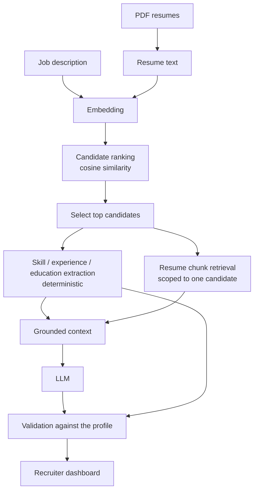
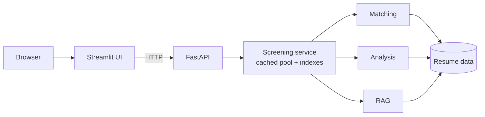

# LLM-Powered Resume Screening & Candidate Matching System

A system that ranks candidates against a job description. It is built in phases;
**Phases 1 to 6 are complete**.

| Phase | Scope | Status |
| --- | --- | --- |
| 1 | PDF resume ingestion and text extraction | Done |
| 2 | Semantic matching with embeddings and FAISS | Done |
| 3 | Skill extraction and candidate analysis | Done |
| 4 | LLM analysis grounded in retrieved evidence (RAG) | Done |
| 5 | FastAPI REST backend | Done |
| 6 | Streamlit recruiter dashboard | Done |
| 7+ | Docker, production polish | Not started |

Explicitly **not** implemented yet: Docker, databases, authentication,
deployment, and OCR for scanned PDFs.

## Quick start

```powershell
pip install -r requirements.txt
python scripts/generate_sample_data.py   # fictional sample resumes
.\start_app.ps1                          # starts the API and the dashboard
```

| | |
| --- | --- |
| Dashboard | <http://localhost:8501> |
| API | <http://127.0.0.1:8000> |
| API docs | <http://127.0.0.1:8000/docs> |

`.\stop_app.ps1` stops both. On macOS or Linux, or to run them separately,
see [Running the two services](#running-the-two-services).

No API key is needed: the LLM provider defaults to an offline deterministic
one. See *Configuration* to point it at a real model.

## Architecture

Eight stages, each owned by one module. Nothing below re-implements anything
above it.

### 1. Ingestion
PDF resumes are parsed into clean text. `resume_parser.py`

### 2. Ranking
The job description and every resume are embedded and compared by cosine
similarity, with FAISS doing the search. This orders the pile; it decides
nothing. `embeddings.py`, `vector_store.py`, `matching.py`

### 3. Candidate analysis
Skills, years of experience and degrees are extracted by deterministic rules
against a fixed taxonomy — no model involved, so the result is exact and
explainable. `skill_taxonomy.py`, `skill_extractor.py`,
`experience_extractor.py`, `education_extractor.py`, `candidate_analyzer.py`

### 4. Grounded retrieval
The selected candidate's resume is split into overlapping chunks, each indexed
in that candidate's **own** FAISS index, and the passages closest to the job
requirements are retrieved. One index per candidate is what makes cross-
contamination structurally impossible rather than a filter that could have a
bug. `chunker.py`, `retriever.py`

### 5. LLM analysis
The job description, the deterministic profile and the retrieved passages —
and nothing else — are assembled into a prompt. The model sees only material
that came from this candidate. `rag_context.py`, `prompts.py`, `llm.py`

### 6. Validation
The response is parsed and checked against the deterministic profile. Skills
the resume does not support are removed, invented durations and degrees are
flagged, and a recommendation outside the vocabulary becomes
`INSUFFICIENT_INFORMATION`. Every correction is recorded in `warnings`.
`analysis_parser.py`, orchestrated by `rag_pipeline.py`

### 7. API
FastAPI exposes the whole thing over HTTP, holding the parsed pool and its
indexes in memory so they are built once rather than per request. `app/api/`

### 8. UI
Streamlit provides the recruiter dashboard. It is a pure client: it talks to
the API over HTTP and imports nothing from the layers above. `app/ui/`

### The pipeline



Everything left of `LLM` is deterministic: the same resume and the same job
description always produce the same skills, the same experience verdict and the
same retrieved passages. Only the summary and the recommendation are generated,
and both are checked before they are shown.

### Request path



The dashboard never reads a resume from disk, never loads a model, and never
imports `app.api.service` or any Phase 1–4 module — a test enforces that. Point
`API_BASE_URL` elsewhere and the same dashboard drives a backend on another
machine.

### The four measures

A candidate ends up with four figures. They come from different places and
regularly disagree; that disagreement is information, not a bug.

| | What it is | Where it comes from | Shown as |
| --- | --- | --- | --- |
| **Semantic similarity** | How alike the resume and the job description read in embedding space | Measured — cosine similarity | `59.35%` |
| **Skill coverage** | How many named requirements the resume actually mentions | Extracted — deterministic, from a fixed taxonomy | `11 / 12` |
| **Experience** | Whether stated years meet stated years | Extracted — three-way, unknown stays unknown | `Requirement met` |
| **Recommendation** | A coarse ordinal assessment | Generated by the LLM, then validated | `Strong match` |

**similarity ≠ skill coverage ≠ recommendation.** A candidate can read as very
similar and cover few requirements — that usually means the resume is written in
the same register as the job description without containing the substance. The
dashboard shows all four side by side for exactly that reason.

The percentage on similarity is a readability convention for a value that runs
0–1, not a probability. The stored and API-returned value is the raw cosine
number, unchanged.

## Phase 1 scope — resume parsing

- Accept a path to a PDF resume.
- Open the file safely and extract text from every page.
- Normalize whitespace and drop empty lines.
- Fail with clear messages for missing files, non-PDF files, corrupted PDFs,
  and PDFs with no selectable text.

## Phase 2 scope — semantic matching

- Embed resumes and job descriptions with Sentence Transformers.
- Index resume vectors in FAISS.
- Rank candidates against a job description by cosine similarity.
- Return `candidate_id`, `candidate_name`, `similarity_score`, and `rank`.

## Phase 3 scope — skill and candidate analysis

- Extract skills from resumes and job descriptions against a configurable taxonomy.
- Report matched and missing skills.
- Extract stated years of experience, conservatively.
- Extract common degree formats.
- Build a structured `CandidateProfile` per candidate.
- Compare candidate experience against an explicitly stated requirement.

All Phase 3 extraction is deterministic string matching. No model is involved.

## Phase 4 scope — LLM + RAG

- Chunk resumes and index the chunks for retrieval.
- Retrieve the passages relevant to a job description, per candidate.
- Build a grounded prompt from job description + Phase 3 profile + evidence.
- Call an LLM through a provider abstraction (offline default, no key needed).
- Parse the response into a typed `CandidateAnalysis`.
- Validate every claim against the deterministic profile and correct it.
- Keep the supporting evidence attached to the analysis.

## Phase 5 scope — REST API

- Expose the existing pipeline over HTTP with FastAPI.
- Validate every request and response with Pydantic models.
- Return consistent, non-leaking errors with useful status codes.
- Parse and index resumes once, not per request.
- Serve generated OpenAPI/Swagger documentation.
- Keep the CLI working unchanged.

## Phase 6 scope — recruiter dashboard

- A Streamlit front end that talks to the API over HTTP and nothing else.
- Job description input, multi-file PDF upload, ranking, candidate detail.
- Matched skills, gaps, experience, education, AI summary and evidence.
- Filtering, sorting and two charts that answer real questions.
- Loading, empty, success, error and API-unavailable states throughout.
- A design system and accessibility pass from the `ui-ux-pro-max` skill.

## Project structure

```
resume-screening-ai/
│
├── app/
│   ├── __init__.py
│   ├── resume_parser.py     # Phase 1: PDF validation, extraction, normalization
│   ├── embeddings.py        # Phase 2: Sentence Transformers wrapper
│   ├── vector_store.py      # Phase 2: FAISS index + metadata
│   ├── matching.py          # Phase 2: ranking engine
│   ├── skill_taxonomy.py    # Phase 3: configurable skill vocabulary
│   ├── skill_extractor.py   # Phase 3: skill extraction and comparison
│   ├── experience_extractor.py  # Phase 3: stated years of experience
│   ├── education_extractor.py   # Phase 3: degree extraction
│   ├── candidate_analyzer.py    # Phase 3: builds CandidateProfile records
│   ├── chunker.py           # Phase 4: deterministic resume chunking
│   ├── retriever.py         # Phase 4: per-candidate FAISS retrieval
│   ├── rag_context.py       # Phase 4: assembles the grounded context
│   ├── prompts.py           # Phase 4: prompt templates + grounding rules
│   ├── llm.py               # Phase 4: provider abstraction
│   ├── analysis_parser.py   # Phase 4: parses + validates LLM output
│   ├── rag_pipeline.py      # Phase 4: end-to-end orchestration
│   ├── models.py            # Typed records shared across phases
│   ├── main.py              # CLI: extract / match / analyze / rag subcommands
│   └── api/                 # Phase 5: REST layer over everything above
│       ├── main.py          #   app factory + metadata (uvicorn entry point)
│       ├── routes.py        #   endpoints; delegate only
│       ├── schemas.py       #   Pydantic request/response models
│       ├── service.py       #   cached pool, indexes and candidate lookup
│       ├── dependencies.py  #   shared FastAPI dependencies
│       ├── config.py        #   settings read from the environment
│       └── errors.py        #   consistent error responses
│   └── ui/                  # Phase 6: Streamlit dashboard (an API client)
│       ├── dashboard.py     #   entry point: streamlit run app/ui/dashboard.py
│       ├── pages.py         #   the four screens
│       ├── components.py    #   badges, cards, evidence blocks, charts, states
│       ├── api_client.py    #   the only module that speaks HTTP
│       ├── formatting.py    #   pure display helpers
│       ├── state.py         #   session state and invalidation
│       ├── theme.py         #   design tokens + stylesheet
│       └── config.py        #   settings from the environment
│
├── data/
│   ├── resumes/             # Put your PDFs here (git-ignored)
│   └── job_descriptions/    # Sample job descriptions (committed, fictional)
│
├── scripts/
│   └── generate_sample_data.py   # Writes synthetic sample resumes
│
├── tests/
│   ├── conftest.py          # Fixtures + offline FakeEmbedder
│   ├── test_resume_parser.py
│   ├── test_main.py
│   ├── test_embeddings.py
│   ├── test_vector_store.py
│   ├── test_matching.py
│   ├── test_skill_taxonomy.py
│   ├── test_skill_extractor.py
│   ├── test_experience_extractor.py
│   ├── test_education_extractor.py
│   ├── test_candidate_analyzer.py
│   ├── test_chunker.py
│   ├── test_retriever.py
│   ├── test_rag_context.py
│   ├── test_llm.py
│   ├── test_analysis_parser.py
│   ├── test_rag_pipeline.py
│   ├── test_real_llm.py     # opt-in, needs credentials
│   ├── test_api_health.py
│   ├── test_api_candidates.py
│   ├── test_api_matching.py
│   ├── test_api_analysis.py
│   ├── test_api_upload.py
│   ├── test_api_errors.py
│   ├── test_api_service.py
│   ├── test_api_upload_store.py
│   ├── test_ui_api_client.py
│   ├── test_ui_formatting.py
│   ├── test_ui_state.py
│   ├── test_ui_app.py       # renders the real app via Streamlit AppTest
│   ├── test_integration.py
│   └── test_integration_phase3.py
│
├── .streamlit/
│   └── config.toml          # Streamlit base theme
├── .run/                    # pids + service logs (git-ignored)
├── start_app.ps1            # start API + dashboard
├── stop_app.ps1             # stop only what start_app started
├── .gitignore
├── .env.example
├── pytest.ini
├── README.md
└── requirements.txt
```

## Installation

Requires Python 3.10 or newer.

### 1. Create a virtual environment

Windows (PowerShell):

```powershell
python -m venv .venv
.\.venv\Scripts\Activate.ps1
```

macOS / Linux:

```bash
python3 -m venv .venv
source .venv/bin/activate
```

> **Windows path-length note.** Phase 2 pulls in PyTorch, which ships files
> nested deeply enough to exceed the legacy 260-character `MAX_PATH` limit. If
> `pip install` fails with `[WinError 206] The filename or extension is too
> long`, either enable long paths
> (`HKLM\SYSTEM\CurrentControlSet\Control\FileSystem\LongPathsEnabled = 1`,
> needs admin) or create the virtual environment somewhere short, such as
> `python -m venv C:\venvs\rsai`.

### 2. Install dependencies

```bash
pip install -r requirements.txt
```

This installs PyTorch and roughly 1.5 GB of packages. The first `match` run also
downloads the embedding model (~90 MB) into the Hugging Face cache
(`~/.cache/huggingface`); later runs are offline.

### 3. Optional environment file

No secrets are needed. The template documents the resume directory, the
embedding model, the optional LLM provider and the API settings:

```bash
cp .env.example .env      # Windows: copy .env.example .env
```

## Sample data

Generate a set of fictional resumes to try things out:

```bash
python scripts/generate_sample_data.py
```

That writes nine invented candidates into `data/resumes/` — six technical
profiles plus three finance ones (a strong, a partial and a poor match) used to
demonstrate Phase 3. The folder is
git-ignored (except `.gitkeep`), so neither the samples nor any real candidate
resume ever reaches version control. Sample job descriptions live in
`data/job_descriptions/` and are committed, since they contain no personal data.

## Phase 1 — extracting text from one resume

```bash
python -m app.main extract data/resumes/priya_sharma.pdf
```

The Phase 1 form without a subcommand still works and means the same thing:

```bash
python -m app.main data/resumes/priya_sharma.pdf
```

Write the result to a file instead of the terminal:

```bash
python -m app.main extract data/resumes/priya_sharma.pdf -o output/priya.txt
```

### Expected output

```
$ python -m app.main extract data/resumes/priya_sharma.pdf
Priya Sharma
Senior Python Backend Engineer
priya.sharma@example.com | Bengaluru, India
SUMMARY
Backend engineer with 8 years building scalable Python microservices
and REST APIs on AWS. Strong focus on distributed systems and
database performance.
...
```

Blank lines are stripped: PDFs encode visual spacing as coordinates, not as
empty text lines, so the normalizer has nothing to preserve there. Section
headings still land on their own lines.

## Phase 2 — ranking candidates against a job description

```bash
python -m app.main match --job-description data/job_descriptions/backend_engineer.txt
```

Useful options:

```bash
# Inline job description instead of a file
python -m app.main match --job-text "Senior Python backend engineer, FastAPI and PostgreSQL"

# A different resume folder, top 3 only
python -m app.main match -r data/resumes -j data/job_descriptions/ml_engineer.txt -k 3
```

### Example output

```
$ python -m app.main match --job-description data/job_descriptions/backend_engineer.txt
Embedding 6 resume(s) with sentence-transformers/all-MiniLM-L6-v2 ...
Rank  Candidate        Similarity
----  ---------------  ----------
   1  Priya Sharma         0.7851
   2  David Kim            0.6705
   3  Marcus Chen          0.4753
   4  Elena Rodriguez      0.3991
   5  Aisha Okafor         0.3540
   6  Tom Baker            0.1528
```

Priya (Python backend) tops a backend role and Tom (pastry chef) sits last.
Swap in `ml_engineer.txt` and Marcus Chen moves to rank 1 — the ranking follows
the job description, which is the whole point of matching on meaning.

## How Phase 2 works

### What "semantic matching" means

Keyword matching asks *does this resume contain the word "Python"?* It misses a
resume that says "Django" but never spells out "backend", and it is fooled by a
resume that lists a keyword once in passing.

Semantic matching compares *meaning* instead. Each document becomes a point in a
high-dimensional space, positioned so that texts about similar things land near
each other. "Built REST APIs in Django" ends up close to "Python backend
development" even with no shared words.

### How embeddings work, briefly

An embedding model reads text and outputs a fixed-length vector of numbers — 384
of them for the model used here. The model was trained so that sentence pairs
meaning the same thing produce vectors pointing in similar directions.
"Direction" is the operative word: similarity is measured as the **cosine of the
angle** between two vectors, which ignores length and captures only orientation.

### Why Sentence Transformers

Raw transformer models such as BERT produce one vector per token, and naively
averaging them compares poorly. Sentence Transformers models are fine-tuned
specifically so that a single vector represents a whole passage and cosine
similarity between two such vectors is meaningful.

The default is `sentence-transformers/all-MiniLM-L6-v2`: 384 dimensions, ~90 MB,
fast enough on CPU for local development, and a well-established general-purpose
baseline. Override it with `--model`.

### Why FAISS

FAISS is a similarity-search library for dense vectors. This project uses
`IndexFlatIP`, an exact inner-product index.

Because the embeddings are **L2-normalized when generated**, the inner product
between two vectors *is* their cosine similarity. That means the number FAISS
returns is used directly as the score — **no rescaling or transformation is
applied**. Exact search is the right default at this scale: for hundreds or
thousands of resumes it is fast, needs no training step, and unlike the
approximate indexes (IVF, HNSW) it never misses a relevant candidate. The index
is in-memory only; persistence is deliberately left for a later phase.

### How ranking works

1. Every resume PDF in the folder is parsed to text (Phase 1).
2. All resume texts are embedded in **one batched call**.
3. The vectors go into a FAISS index, each carrying its `Candidate` as metadata.
4. The job description is embedded with the same model.
5. FAISS returns the nearest resume vectors, sorted by descending similarity.
6. Each hit becomes a `MatchResult` with a 1-based `rank`.

### What the similarity score means — and does not

`similarity_score` is the cosine similarity between the job-description
embedding and the resume embedding.

- **Range.** Mathematically `[-1.0, 1.0]`. In practice this model maps English
  prose into a narrow cone, so on the sample data a strong match scores about
  `0.70–0.80`, a loosely related profile `0.35–0.50`, and an unrelated one
  around `0.15`.
- **It is a semantic similarity score.** It measures how close two pieces of
  text are in the embedding space.
- **It is not a probability of being hired**, not a percentage of requirements
  met, and not a measure of candidate quality. It is deliberately reported as a
  raw score rather than dressed up as a percentage, because scaling it to
  "78% match" would imply a statistical meaning it does not have.
- **Only relative ordering within one run is meaningful.** Absolute values are
  not comparable across different job descriptions.

## Phase 3 — analysing candidates

```bash
python -m app.main analyze --job-description data/job_descriptions/financial_analyst.txt
```

Same options as `match`, plus `--show-extra-skills` to list skills the job did
not ask for:

```bash
python -m app.main analyze -j data/job_descriptions/financial_analyst.txt -k 3
python -m app.main analyze -t "Financial analyst, 3+ years, Python and SQL" --show-extra-skills
```

### Example output

```
JOB REQUIREMENTS
  Required Skills: Python, SQL, Excel, Power BI, Tableau, Data Analysis, ...
  Minimum Experience: 3 years

CANDIDATES

2. Sarah Wilson
  Semantic Match Score: 0.5940
  Matched Skills:
    - Python
    - SQL
    - Excel
    - Power BI
    - Tableau
    ...
  Missing Skills:
    - Investment Analysis
  Skill Coverage: 12/13 required skills (92%)
  Experience:
    Candidate: 4 years
    Required:  3 years
    Requirement Met: Yes
  Education:
    MBA - Finance
    Bachelor of Commerce - Accounting

3. James Patel
  Semantic Match Score: 0.4416
  Skill Coverage: 4/13 required skills (31%)
  Experience:
    Candidate: 2 years
    Required:  3 years
    Requirement Met: No

8. Nina Volkov
  Semantic Match Score: 0.1491
  Matched Skills: none
  Skill Coverage: 0/13 required skills (0%)
  Experience:
    Candidate: not stated on resume
    Required:  3 years
    Requirement Met: Unknown
      (unknown is reported as unknown, not as a pass or a fail)
```

Note that Sarah is ranked **2**, not 1, by semantic similarity, yet covers 92% of
the required skills and clears the experience bar. This is exactly why Phase 3
exists: a single similarity number cannot tell you *which* requirements a
candidate meets, and the candidate the embedding likes most is not always the
one who best fits the stated requirements. The two views are complementary, and
both are shown.

## How Phase 3 works

### Skill extraction

Extraction is exact matching against a fixed vocabulary — no model, no
statistics. The same resume always yields the same skills, and every hit can be
traced to the substring that produced it (`SkillExtractor.find_mentions` returns
the matched text and its offsets).

Naive substring matching would be badly wrong here. `"SQL" in text` reports SQL
for *PostgreSQL*, *MySQL* and *sqlalchemy*; `"R"` reports R for every word
containing the letter. Each alias is therefore compiled into a regex with custom
boundaries:

| Guard | Effect |
| --- | --- |
| `(?<![A-Za-z0-9+#&])` before | *MySQL* does not yield SQL; *R&D* does not yield R |
| `(?![A-Za-z0-9+#&])` after | *C++* does not yield C; *sqlalchemy* does not yield SQL |
| `(?!\.\w)` after | *Node.js* does not yield Node, while *"Python."* still yields Python |

`\b` alone cannot do this: it is defined in terms of `\w`, so it misbehaves
around `+`, `#` and `.` — precisely the characters real skill names contain.

Two further rules:

- Matching is case-insensitive, **except single-character skills** (`C`, `R`),
  which must be capitalised. Otherwise a bullet like `c) managed the team` would
  register the C language.
- Spaces, hyphens and underscores inside an alias match any run of the same, so
  `Power BI` also matches `power-bi`, `powerbi`, and a `Power` / `BI` line break
  — which PDF extraction produces often.

### Configurable skill taxonomy

Every recognised skill lives in `app/skill_taxonomy.py`, never inline in the
extraction code. A skill has a canonical name, a category, and any number of
aliases. The canonical name is what gets reported, whichever alias matched, so a
resume saying `k8s` satisfies a job asking for `Kubernetes`.

Categories shipped: Programming, Data, AI/ML, Cloud/DevOps, Backend, Finance.

Three ways to extend it, in increasing order of separation from the code:

```python
# 1. Add an entry to DEFAULT_SKILL_DEFINITIONS in the module.

# 2. Extend at runtime; the original is left unchanged.
from app.skill_taxonomy import DEFAULT_TAXONOMY, SkillDefinition
taxonomy = DEFAULT_TAXONOMY.extended([SkillDefinition("Rust", "Programming", ("rustlang",))])

# 3. Load from JSON, keeping the vocabulary out of the codebase entirely.
from app.skill_taxonomy import SkillTaxonomy
taxonomy = SkillTaxonomy.from_json_file("my_skills.json")
# JSON shape: {"Category": {"Skill Name": ["alias", ...]}}
```

Pass a taxonomy to `SkillExtractor(taxonomy)` and the rest of the pipeline
follows it.

### Matched and missing skills

```
required_skills ─┐
                 ├─► matched_skills     (required AND candidate)
candidate_skills ┘   missing_skills     (required NOT candidate)
                     additional_skills  (candidate NOT required)
```

Comparison is by canonical name and case-insensitive. Ordering is deterministic:
`matched` and `missing` follow the order of the required list, `additional`
follows the candidate order. `SkillComparison.coverage` is a plain count ratio,
`len(matched) / required_count` — not a probability, not weighted, and `None`
when the job named no recognised skills.

### Experience extraction

Deliberately conservative: a number is returned only when the text states it in
words, near "experience".

| Input | Result |
| --- | --- |
| `4 years of experience` | `4.0` |
| `3+ years experience` | `3.0` |
| `2.5 years of professional experience` | `2.5` |
| `3-5 years of experience` | `3.0` (lower bound) |
| `Experience: 5 years` | `5.0` |
| `Graduated in 2015` | `None` |
| `Acme Corp (2020-2024)` | `None` |
| `Senior Engineer` | `None` |
| `8 years building Python services` | `None` (no explicit "experience") |

Nothing is inferred from graduation years, employment dates, or seniority words,
and employment periods are never summed. When a resume states several figures the
**largest** is taken as the overall total; when a job description states several,
the **smallest** is taken as the bar to clear.

### Education extraction

Line-by-line matching of known degree spellings — `B.S.`, `BSc`, `B.Tech`,
`B.E.`, `B.Com`, `M.S.`, `MSc`, `M.Tech`, `MBA`, `PhD`, `Ph.D.`, `Diploma`, and
the spelled-out forms — plus the field of study when the same line names one.

Bare `BS` and `MS` are deliberately **not** recognised, because "MS Excel" and
"MS Office" appear on far more resumes than "MS Physics".

### Candidate profiles

`CandidateProfile` is a frozen dataclass carrying `candidate_id`,
`candidate_name`, `skills`, `years_experience`, `education`, `matched_skills`,
`missing_skills`, `additional_skills`, `semantic_match_score`, `rank`,
`required_experience`, `meets_experience_requirement` and `source_path`.

### Experience comparison

| Required | Candidate | `meets_experience_requirement` |
| --- | --- | --- |
| 3.0 | 4.0 | `True` |
| 3.0 | 2.0 | `False` |
| 3.0 | `None` | `None` |
| `None` | 4.0 | `None` |

Unknown is never resolved into a pass or a fail. A resume that simply does not
state its years is not a resume that fails the requirement.

### Using Phase 3 as a library

```python
from pathlib import Path

from app.candidate_analyzer import analyze_candidates_for_job
from app.matching import load_candidates_from_directory

loaded = load_candidates_from_directory("data/resumes")
job_text = Path("data/job_descriptions/financial_analyst.txt").read_text(encoding="utf-8")

requirements, profiles = analyze_candidates_for_job(loaded.candidates, job_text)

for profile in profiles:
    print(profile.rank, profile.display_name)
    print("  matched:", profile.matched_skills)
    print("  missing:", profile.missing_skills)
    print("  experience:", profile.years_experience,
          "meets:", profile.meets_experience_requirement)
```

Or use the pieces on their own:

```python
from app.education_extractor import extract_education
from app.experience_extractor import extract_years_of_experience
from app.skill_extractor import compare_skills, extract_skills

extract_skills("Python, SQL and Power BI for forecasting")
# ('Python', 'SQL', 'Power BI', 'Forecasting')

compare_skills(["Python", "SQL", "Tableau"], ["Python", "SQL"]).missing
# ('Tableau',)

extract_years_of_experience("4 years of experience")   # 4.0
extract_education("MBA in Finance")                    # (EducationEntry('MBA', 'Finance', ...),)
```

## Phase 4 — LLM analysis grounded in retrieved evidence

```bash
python -m app.main rag --job-description data/job_descriptions/financial_analyst.txt
```

This runs with **no API key**: the default provider is an offline deterministic
one. Point it at a real model when you want real prose (see *Configuration*).

Useful options:

```bash
# One candidate only (the resume file stem)
python -m app.main rag -j data/job_descriptions/financial_analyst.txt --candidate sarah_wilson

# Top 3 ranked candidates, evidence hidden
python -m app.main rag -j data/job_descriptions/financial_analyst.txt -k 3 --hide-evidence

# Tune chunking and how much evidence the model sees
python -m app.main rag -j <job.txt> --chunk-size 60 --chunk-overlap 15 --evidence-k 5

# Use a real model for this run
python -m app.main rag -j <job.txt> --llm-provider anthropic --llm-model claude-opus-5
```

### Example output

```
Candidate: Sarah Wilson
Recommendation: STRONG_MATCH

Summary:
  Sarah Wilson matches 12 of 13 skills identified in the job description. ...

Matched Skills:
  - Python
  - SQL
  - Excel
  ...

Skill Gaps:
  - Investment Analysis

Experience:
  The resume states 4 years (stated on resume); the job asks for 3 years. Requirement met: yes.

Evidence (verbatim resume passages given to the model):
  - [sarah_wilson#4, similarity=0.6709]
    Python, Power BI, Tableau, budgeting, risk analysis, data analysis, statistics, ...
  - [sarah_wilson#1, similarity=0.5596]
    for a 40M revenue business unit, rebuilding the financial modeling in Excel around ...
```

For a candidate whose resume never states a duration:

```
Experience:
  Not stated. The resume does not state a number of years, so this cannot be
  compared against the requirement of 3 years.
```

### How the three phases differ

| | What it produces | How it decides | Fails by |
| --- | --- | --- | --- |
| **Phase 2** | A ranked list with a similarity score | Cosine similarity between whole-document embeddings | Ranking a superficially similar resume above a genuinely better one |
| **Phase 3** | Structured fields: skills, experience, education | Exact matching against a fixed taxonomy | Missing anything phrased unusually or absent from the taxonomy |
| **Phase 4** | Prose summary, recommendation, reasoning about gaps | An LLM reading retrieved resume passages | Being fluent and wrong |

They are complementary, and Phase 4 depends on both: it puts the Phase 3 profile
*and* retrieved passages in front of the model, then validates what comes back
against the Phase 3 profile.

### Why RAG rather than pasting the whole resume

For a one-page resume, sending the full text would fit. Retrieval is used anyway
for three reasons:

1. **Attribution.** The output carries the exact passages that informed it, so a
   recruiter can check a claim without rereading the resume. With a whole-resume
   prompt there is nothing to point at.
2. **The embedding model truncates.** `all-MiniLM-L6-v2` stops at 256 word
   pieces. The bundled Sarah Wilson resume is 378 — as a single vector, its
   entire skills and education section is invisible. Chunking makes every part
   reachable.
3. **It keeps the prompt bounded** as resumes and candidate pools grow.

### The pipeline

```
resume PDF
    ↓  app/resume_parser.py        (Phase 1)
resume text
    ↓  app/chunker.py              80-word windows, 20-word overlap
chunks
    ↓  app/embeddings.py           (Phase 2, reused — no second implementation)
vectors
    ↓  app/retriever.py            one FAISS index per candidate
relevant passages
    │
    ├── job description  ─────────┐
    ├── candidate profile ────────┤  app/rag_context.py
    └── retrieved evidence ───────┘
                ↓  app/prompts.py         grounding rules
              prompt
                ↓  app/llm.py             provider abstraction
            raw response
                ↓  app/analysis_parser.py validation against the profile
          CandidateAnalysis
```

### Chunking

Fixed-size sliding window over words, with overlap. Deliberately simple — no
sentence models, no semantic clustering — so it is deterministic and easy to
reason about when a chunk looks wrong.

- Boundaries always fall between words; words are never split.
- Each chunk is the original substring spanning its first and last word, so
  punctuation and line breaks inside a chunk survive exactly.
- Overlap means a fact straddling a boundary still appears whole somewhere.
- Defaults: 80 words with 20 overlap. 80 words is ~110–150 word pieces, well
  inside the 256 cap, and small enough that a retrieved chunk is a *passage*
  rather than most of the resume.

Chunks carry `candidate_id`, `chunk_id`, `text`, `index`, `source` and character
offsets. There is no page number: the Phase 1 parser joins pages into one string
and does not report boundaries, and inventing one would mean rewriting the
parser or guessing.

### Retrieval

`app/retriever.py` reuses the Phase 2 embedder and FAISS store. Retrieval runs
several queries per candidate — the job description plus one per required skill
— because a brief mention of a single requirement is easily outranked by overall
topical similarity when only one query is used. Results are merged, deduplicated
by chunk, and each chunk keeps its best score.

`retrieval_score` is cosine similarity in `[-1, 1]`. It is a **similarity
score**, not a probability and not a confidence that a passage answers the query.

### Candidate isolation

Mixing one person's resume into another's analysis is the worst thing this
system could do, so isolation is **structural rather than a filter**: each
candidate gets their own FAISS index, and a scoped search physically cannot
reach another candidate's vectors.

A single shared index with post-search filtering was rejected deliberately. It
leaks subtly: with `top_k=5`, all five nearest vectors can belong to someone
else, leaving the requested candidate with nothing — and any bug in the filter
produces contamination rather than an error. `app/rag_context.py` re-checks the
invariant and raises `ContextIsolationError` rather than quietly dropping
foreign evidence.

### Grounding and hallucination safeguards

Grounding is enforced in **two independent layers**, because a prompt is a
request, not a guarantee.

**Layer 1 — the prompt** (`app/prompts.py`) instructs the model to use only the
supplied material, to write exactly `Not stated` when a fact is absent, not to
infer skills from job titles or years from employment dates, and not to invent
employers, degrees, certifications or projects.

**Layer 2 — validation** (`app/analysis_parser.py`) checks what came back
against the deterministic Phase 3 profile and *corrects* it:

| Model claim | What happens |
| --- | --- |
| A skill absent from the resume | Removed from `matched_skills`, warning recorded |
| A gap the job never asked for | Removed from `skill_gaps`, warning recorded |
| A recommendation outside the vocabulary | Becomes `INSUFFICIENT_INFORMATION` |
| Years of experience when the resume states none | Replaced with `Not stated`, warning recorded |
| A degree the resume does not contain | Flagged (reusing the Phase 3 education extractor) |
| Its own "evidence" | Ignored — evidence comes from retrieval, never from the model |

Every correction lands in `CandidateAnalysis.warnings`, and `is_grounded` is
`False` when any was needed. Fed a deliberately lying model, all six fabrications
below were caught:

```
claimed: Python, SQL, AWS, Kubernetes   ->  kept: ()
claimed gap: Fortran                    ->  kept: ()
claimed: DEFINITELY_HIRE                ->  kept: INSUFFICIENT_INFORMATION
claimed: 12 years of experience         ->  kept: "Not stated. The resume does not state..."
claimed: PhD in Econometrics            ->  flagged
grounded: False
```

**This reduces hallucination; it does not eliminate it.** Free prose can be
subtly wrong in ways no automated check catches — a plausible-sounding
paraphrase, a wrong emphasis, an unstated inference. That is precisely why the
retrieved evidence travels with every analysis: the output is meant to be
checked, not trusted.

### Structured output

The model is asked for a single JSON object. `CandidateAnalysis` carries
`candidate_id`, `candidate_name`, `summary`, `recommendation`, `matched_skills`,
`skill_gaps`, `experience_assessment`, `evidence`, `limitations`, `model_name`
and `warnings`.

`Recommendation` is a controlled vocabulary — `STRONG_MATCH`, `GOOD_MATCH`,
`PARTIAL_MATCH`, `WEAK_MATCH`, `INSUFFICIENT_INFORMATION`. It is a coarse
ordinal label, **not a score and not a probability**, and never a hiring
decision. Anything outside the vocabulary becomes `INSUFFICIENT_INFORMATION`
rather than being coerced into the nearest-looking value.

Responses wrapped in a markdown fence or surrounded by a sentence are tolerated;
anything else raises `AnalysisParseError`.

### Evidence

Every analysis retains the passages the model was shown, each with
`candidate_id`, `chunk_id`, `text` and `retrieval_score`, so a recruiter can see
where a conclusion came from. Evidence is source text only — never the model's
internal reasoning, which is neither requested nor displayed.

### Configuration

| Variable | Meaning |
| --- | --- |
| `LLM_PROVIDER` | `fake` (default), `anthropic`, or `langchain` |
| `LLM_MODEL` | Model id; default `claude-opus-5` |
| `LLM_API_KEY` | API key; `ANTHROPIC_API_KEY` also accepted |
| `LLM_MAX_TOKENS` | Response cap; default 4096 |

Keys are read from the environment only. Nothing writes a key to disk or logs
one, `.env` is git-ignored, and no key is needed to run the CLI or the tests.

To use a real model:

```bash
pip install anthropic==1.0.0
export LLM_PROVIDER=anthropic
export LLM_API_KEY=sk-ant-...
python -m app.main rag -j data/job_descriptions/financial_analyst.txt --candidate sarah_wilson
```

**On LangChain.** `app/llm.py` ships a `LangChainProvider` that adapts any
LangChain chat model, which is where LangChain earns real value here: one
adapter buys every backend LangChain supports. The rest of the project does not
import it — retrieval, prompting and output parsing are ~200 lines of standard
library over the existing FAISS stack, and wrapping them in LangChain
abstractions would add dependencies without changing behaviour.

```python
from langchain_anthropic import ChatAnthropic
from app.llm import LangChainProvider
from app.rag_pipeline import RagPipeline

pipeline = RagPipeline(llm=LangChainProvider(ChatAnthropic(model="claude-opus-5")))
```

### Using Phase 4 as a library

```python
from pathlib import Path

from app.matching import load_candidates_from_directory
from app.rag_pipeline import RagPipeline

loaded = load_candidates_from_directory("data/resumes")
job = Path("data/job_descriptions/financial_analyst.txt").read_text(encoding="utf-8")

pipeline = RagPipeline()                       # offline provider by default
pipeline.index_candidates(loaded.candidates)   # chunk + embed once

analysis = pipeline.analyze_candidate("sarah_wilson", job)

print(analysis.recommendation.value)
print(analysis.summary)
for item in analysis.evidence:
    print(item.chunk_id, round(item.retrieval_score, 4), item.text[:80])

if not analysis.is_grounded:
    for warning in analysis.warnings:
        print("corrected:", warning)
```

Indexing is separate from analysis, so one indexed pool can be analysed against
several job descriptions without re-chunking or re-embedding. `analyze_all`
ranks with the Phase 2 matcher first, then analyses in rank order — one model
call per candidate, which is what `-k` controls.

## Phase 5 — the REST API

Everything above is available over HTTP. The API is a thin layer: it validates
requests, calls the same functions the CLI calls, and renders the results. No
parsing, ranking, extraction, retrieval or prompting is reimplemented in it.

```bash
uvicorn app.api.main:app --reload
```

Then open **<http://127.0.0.1:8000/docs>** for Swagger UI, `/redoc` for ReDoc, or
`/openapi.json` for the raw schema.

The CLI is unaffected — `python -m app.main rag -j <job.txt>` works exactly as
before, with or without the server running.

### Endpoints

| Method | Path | What it does |
| --- | --- | --- |
| `GET` | `/health` | Liveness. Loads no model, reads no resume. |
| `GET` | `/candidates` | Lists the resumes in the server's configured directory. |
| `POST` | `/upload-resume` | Parses one uploaded PDF and reports what was extracted. |
| `POST` | `/match-candidates` | Ranks the resume pool against a job description. |
| `POST` | `/analyze-candidate` | Full RAG analysis of one candidate, with evidence. |

### Examples

**Health**

```bash
curl http://127.0.0.1:8000/health
```

```json
{
  "status": "healthy",
  "service": "resume-screening-api",
  "version": "0.1.0",
  "llm_provider": "fake"
}
```

**Ranking** — the pool is the server's `RESUME_DIR`, never a path from the client.

```bash
curl -X POST http://127.0.0.1:8000/match-candidates \
  -H "Content-Type: application/json" \
  -d '{"job_description": "Financial analyst with 3+ years of experience. Strong Excel and SQL.", "top_k": 3}'
```

```json
{
  "results": [
    {"rank": 1, "candidate": "Elena Rodriguez", "candidate_id": "elena_rodriguez", "similarity_score": 0.6024},
    {"rank": 2, "candidate": "Sarah Wilson",    "candidate_id": "sarah_wilson",    "similarity_score": 0.5129},
    {"rank": 3, "candidate": "James Patel",     "candidate_id": "james_patel",     "similarity_score": 0.4702}
  ],
  "count": 3,
  "candidates_considered": 9,
  "score_type": "cosine_similarity",
  "score_note": "Cosine similarity between the job-description embedding and the resume embedding, in [-1.0, 1.0]. A semantic similarity score: not a probability of being hired, ..."
}
```

The score is the raw cosine similarity the FAISS index returned, rounded to four
decimals for display. Nothing is rescaled into a percentage, and `score_note`
travels with the data so the number is hard to misread once it is out of context.

**Analysis** — `candidate` accepts an id, a display name or a file name.

```bash
curl -X POST http://127.0.0.1:8000/analyze-candidate \
  -H "Content-Type: application/json" \
  -d '{"candidate": "sarah_wilson", "job_description": "Financial analyst with 3+ years of experience..."}'
```

```json
{
  "candidate": "Sarah Wilson",
  "candidate_id": "sarah_wilson",
  "recommendation": "STRONG_MATCH",
  "recommendation_note": "A coarse ordinal label, not a score and not a probability. ...",
  "summary": "Sarah Wilson matches 12 of 13 skills identified in the job description. ...",
  "matched_skills": ["Python", "SQL", "Excel", "Power BI", "Tableau", "..."],
  "skill_gaps": ["Investment Analysis"],
  "experience_assessment": "The resume states 4 years (stated on resume); the job asks for 3 years. Requirement met: yes.",
  "evidence": [
    {
      "candidate_id": "sarah_wilson",
      "chunk_id": "sarah_wilson#4",
      "text": "Python, Power BI, Tableau, budgeting, risk analysis, data analysis, ...",
      "retrieval_score": 0.6709
    }
  ],
  "limitations": [],
  "warnings": [],
  "is_grounded": true,
  "model": "fake/deterministic-v1"
}
```

`model` names what produced the analysis. `fake/deterministic-v1` is the offline
provider, not a language model — set `LLM_PROVIDER=anthropic` and a key for real
prose. Every Phase 4 safeguard applies unchanged over HTTP: unsupported claims
are stripped, `warnings` records what was corrected, and `is_grounded` is `false`
whenever anything was.

**Upload**

```bash
curl -X POST http://127.0.0.1:8000/upload-resume -F "file=@data/resumes/sarah_wilson.pdf"
```

```json
{
  "filename": "sarah_wilson.pdf",
  "status": "success",
  "text_length": 1987,
  "word_count": 269,
  "preview": "Sarah Wilson\nSenior Financial Analyst\n..."
}
```

The file is written to a temporary location, parsed, and deleted. It is **not**
stored and does **not** join the candidate pool — the pool is always the server's
own resume directory. The full text is not returned, only its size and a
200-character preview.

### Errors

Every error has the same shape, whatever raised it:

```json
{"detail": "Only PDF files are supported.", "code": "unsupported_file_type"}
```

| Status | When |
| --- | --- |
| `400` | The file or the request content is unusable — not a PDF, corrupt, empty, no selectable text |
| `404` | Unknown candidate, or the resume directory is missing or empty |
| `413` | The upload exceeds `API_MAX_UPLOAD_BYTES` |
| `422` | Pydantic rejected the request body — missing field, blank string, `top_k` out of range |
| `500` | Unexpected server-side failure |
| `502` | The LLM provider failed or returned something unusable |

A `422` adds an `errors` array naming the offending fields. It does not echo the
submitted text back.

**Nothing internal is ever returned**: no traceback, no filesystem path (including
the temporary upload path), no environment variable, and no 5xx exception text.
Server-side failures are logged in full and answered with a fixed sentence. This
is asserted in the tests, not just intended.

### Configuration

The API reads the same `.env` conventions as the rest of the project.

| Variable | Meaning |
| --- | --- |
| `RESUME_DIR` | Directory the candidate pool is read from. Default `data/resumes` |
| `EMBEDDING_MODEL` | Sentence Transformers model id |
| `API_CORS_ORIGINS` | Comma-separated allowed origins. Default: localhost:8501 |
| `API_MAX_UPLOAD_BYTES` | Upload ceiling. Default 5 MB |
| `API_LOG_LEVEL` | Level for the `app` logger. Default `INFO` |

`LLM_PROVIDER`, `LLM_MODEL`, `LLM_API_KEY` and `LLM_MAX_TOKENS` behave exactly as
in Phase 4 and are read by `app/llm.py`; the API neither re-reads them nor reports
whether a key is set.

CORS defaults to `http://localhost:8501` — where the Phase 6 dashboard will run.
`API_CORS_ORIGINS=*` opens it to any origin, logs a warning saying so, and is a
development-only setting.

### How requests stay cheap

Resumes are parsed, embedded and chunked **once**, not per request. The service
holds the pool, the FAISS indexes and the transformer model, and rebuilds them
only when the resume directory changes — keyed by each file's name, size and
modification time, so a new resume is picked up without a restart. On the bundled
sample data, the first `/match-candidates` request takes several seconds to load
the model and embed nine resumes; subsequent ones take about 30 ms.

Route functions that do this blocking work are declared `def`, not `async def`,
so FastAPI runs them in a worker thread instead of stalling the event loop.

### Security notes

- **PDF only**, checked by extension *and* leading `%PDF` bytes.
- **Size-capped**, enforced while streaming so an oversized file is abandoned
  rather than buffered.
- **No path from a client is ever used.** Upload names are reduced to a bare file
  name and never joined to a path; a candidate reference is looked up in the pool
  and rejected outright if it contains `/` or `\`. Temporary files get generated
  names and are deleted in a `finally` block.
- **Nothing sensitive is logged**: endpoints, file names, sizes and outcomes —
  never resume text, candidate details or credentials.
- **There is no authentication.** That is out of scope for this phase. Run it
  locally, and do not expose it to an untrusted network or upload real candidate
  data to a deployment you do not control.

## Phase 6 — the recruiter dashboard

A Streamlit front end over the Phase 5 API. It is a **client**: every number it
shows arrived over HTTP, and it imports nothing from `app.api` or from the
Phase 1–4 modules. A test asserts that.

### Running the two services

On Windows, one command starts both:

```powershell
.\start_app.ps1              # or: .\start_app.ps1 -ApiPort 8100 -UiPort 8600
.\stop_app.ps1
```

`start_app.ps1` finds a usable Python (`$env:PYTHON`, an active virtualenv, a
project `.venv`, then `python` on PATH — no path is hardcoded), checks the
required packages are installed, starts both services, waits for each to answer
a health check, and prints the URLs. Running it twice is safe: a service that is
already up is reported and left alone.

`stop_app.ps1` stops **only** the processes `start_app.ps1` started. It records
each process id together with its start time in `.run/`, verifies both before
stopping anything — Windows reuses process ids — and stops child processes
first, because `uvicorn --reload` runs the application in a child that would
otherwise be orphaned holding the port. It never matches processes by name, so
it cannot touch another project's Python. It is safe to run when nothing is
running.

`.run/` holds the pids and the service logs, and is git-ignored.

Or run them by hand, in two terminals, backend first:

```bash
uvicorn app.api.main:app --reload      # terminal 1
streamlit run app/ui/dashboard.py      # terminal 2
```

Then open <http://localhost:8501>. If the API is somewhere else, point the
dashboard at it:

```bash
API_BASE_URL=http://192.168.1.20:8000 streamlit run app/ui/dashboard.py
```

The dashboard needs no filesystem access of its own — no resume directory, no
model, no key. If the API is not running it says so and shows how to start it,
rather than displaying a screen of zeroes.

### The workflow

```
Overview ──► Screening ──────────────────► Ranking ──► Candidate
             1. paste job description      table       skills · gaps
             2. upload PDF resumes         charts      experience · education
             3. rank the pool              filters     AI summary · evidence
```

**Overview** — what this session holds: candidates loaded, candidates analysed,
strong matches, mean similarity, and where you are in the three steps. Figures
that do not exist yet read *Not analyzed yet*, never `0`.

**Screening** — paste the job description, upload one or more PDFs, then rank.
Uploads go through `POST /upload-resume` with `store=true`, so they join the
pool and become rankable. Accepted and rejected files are listed separately with
the reason for each rejection.

**Ranking** — the ranked table with search, a recommendation filter, a minimum
similarity slider, and four sort orders. A horizontal bar chart shows how far
ahead the leader is; a stacked bar shows matched-versus-missing skills for
anyone analysed. Skill coverage, experience and recommendation come from an
analysis, which costs a model call, so they fill in only for candidates you
choose to analyse — everyone else reads *Not analyzed yet*, with a hint
explaining what analysis would add. Ranking and analysis are separate
operations, and the label says so rather than implying a failure.

**Candidate** — the full picture for one person: similarity, recommendation,
grounding status, matched skills, gaps, experience, education, the AI summary,
and the retrieved evidence.

Changing the job description clears the ranking and every analysis. They were
produced for a different role, and leaving them on screen under a new heading
would be quietly wrong.

### Evidence is never mistaken for interpretation

The detail view renders the two in visibly different containers: retrieved
resume text is monospace on a tinted ground behind a solid rule and labelled
*From resume · chunk id · similarity*; the model's prose sits on a white card
behind a dashed rule labelled *AI-generated interpretation*, with the model name
underneath. A recruiter should never have to work out which half of the page the
resume actually said.

### What the numbers are allowed to say

The dashboard inherits the backend's rules and does not soften them:

* A similarity score is shown as a percentage of the cosine scale — `0.5935`
  reads as `59.35%` — because that is far easier to scan than four decimals.
  The percent sign is a readability convention for a value that runs 0–1, and
  the sentence beside it says so outright: *"Semantic similarity between the job
  description and candidate resume embeddings. This is a ranking signal, not a
  hiring probability or percentage of requirements met."* The candidate detail
  view also shows the raw cosine value, so the backend number is never hidden.
  **The API response and every stored value are unchanged** — this is
  presentation only.
* Alongside the figure is a word — *Strong / Moderate / Low similarity* — so the
  reading never depends on colour.
* Skill coverage stays a count — `11 / 12`, never a percentage — so it cannot be
  mistaken for the similarity figure beside it.
* A recommendation is shown as a label with its "coarse ordinal, not a score"
  caveat attached.
* Unknown is never rendered as zero, a pass or a failure.

### Design

The visual system is the output of the `ui-ux-pro-max` skill, which returns
**Minimalism & Swiss Style** for this product type — twice, for "recruitment
hiring dashboard" and for "enterprise hr analytics admin dashboard" — noting its
best fit as "enterprise apps, dashboards, professional tools". Its colour
strategy for that pattern is a *neutral* canvas with status colours, not blue
everywhere:

* neutrals sit on a slate ramp and carry the canvas, cards, borders and text;
* **blue is reserved** for primary actions, the active nav item, links, focus
  rings and the top-match rule — nothing decorative is blue;
* **status is green / amber / red**, and always paired with a word.

Type is Inter for text and Fira Code for every figure, so numbers are tabular
and columns do not jitter. Elevation uses the first two levels of the skill's
four-level scale; a professional tool wants edges and restraint, not depth.

`.streamlit/config.toml` carries the base theme for Streamlit's own widgets;
`app/ui/theme.py` holds the same tokens as CSS for everything Streamlit has no
theme option for. Neither file repeats a colour the other defines.

Two of the skill's colours are used differently from how it returned them. Its
own accessibility rule requires 4.5:1 for body text, and the accent green reaches
about 3.1:1 on white, so text uses a darker variant while the original stays for
fills, borders and chart marks, where the 3:1 non-text threshold applies. The
skill's rule wins over the skill's swatch.

Accessibility, following the same skill's checklist: every status carries a word
as well as a colour, skill gaps are dashed as well as red, focus rings are
strengthened rather than removed, `prefers-reduced-motion` is respected, long
names wrap instead of truncating, figures use tabular numerals, and each chart
has the sortable table beside it as its text equivalent.

Charts are limited to the two that answer questions a table hides — how far ahead
the leader is, and who covers the requirements. There is no decorative chart, and
no score-distribution histogram: with a handful of candidates it would suggest a
distribution that is not there.

### Structure

```
app/ui/
├── dashboard.py    # entry point: page config, theme, sidebar, dispatch
├── pages.py        # the four screens
├── components.py   # badges, chips, cards, evidence blocks, charts, states
├── api_client.py   # the only module that speaks HTTP
├── formatting.py   # pure display helpers (bands, labels, coverage)
├── state.py        # session state and its invalidation rules
├── theme.py        # design tokens and the stylesheet built from them
└── config.py       # settings from the environment
```

The entry point is `dashboard.py`, not `app.py`: a Streamlit script named
`app.py` registers a top-level module `app` that shadows this project's `app`
package outright, and no `sys.path` ordering undoes that.

### Configuration

| Variable | Meaning |
| --- | --- |
| `API_BASE_URL` | Backend root. Default `http://127.0.0.1:8000` |
| `API_TIMEOUT_SECONDS` | Health, listing, upload and matching. Default 30 |
| `API_ANALYSIS_TIMEOUT_SECONDS` | Analysis, which calls a model. Default 180 |
| `UI_DEFAULT_TOP_K` | Candidates the ranking asks for. Default 10 |

Unparsable values fall back to these defaults rather than raising, so a typo
cannot stop the dashboard from starting with no way to see why.

## Using the engine as a library

```python
from app.matching import load_candidates_from_directory, rank_candidates

loaded = load_candidates_from_directory("data/resumes")
for failure in loaded.failures:
    print(f"skipped {failure.path.name}: {failure.reason}")

results = rank_candidates(loaded.candidates, "Senior Python backend engineer")
for result in results:
    print(result.rank, result.display_name, round(result.similarity_score, 4))
```

To score one set of resumes against several job descriptions, index once:

```python
from app.matching import CandidateMatcher

matcher = CandidateMatcher()
matcher.index_candidates(loaded.candidates)          # embeds resumes once
backend = matcher.match("Senior Python backend engineer")
ml_role = matcher.match("NLP engineer, PyTorch and embeddings")
```

## Running the tests

```bash
pytest                       # everything that runs offline
pytest tests/test_api_*.py   # just the REST API suites
pytest tests/test_ui_*.py    # just the dashboard suites
pytest -m "not model"        # skip even the embedding-model tests
pytest -m model              # only tests using real embedding weights
pytest -m llm                # only tests calling a real LLM (needs credentials)
```

The default run needs **no API key and no network**: the LLM tests are marked
`llm` and skip unless `LLM_PROVIDER`/`LLM_API_KEY` are set, and Phase 4 itself
defaults to an offline deterministic provider.

Most tests run against a deterministic bag-of-words `FakeEmbedder` defined in
`tests/conftest.py`, so the suite is fast, offline, and reproducible. Depending
on real transformer weights everywhere would make it slow and network-bound, and
floating-point output can shift between model revisions. The fake still produces
genuine cosine similarities — texts sharing vocabulary score higher — so the
ranking assertions test real logic.

Tests that must exercise the actual model are marked `model` and **skip
automatically** when the weights cannot be loaded, so the suite still passes on a
machine with no network access.

The API suites use FastAPI's `TestClient` against an app whose service
dependency is overridden to point at a temporary resume directory, the offline
embedder and the offline LLM provider. No API test downloads model weights,
touches `data/resumes/`, opens a socket, or needs a key.

The dashboard suites do the same one layer up. `test_ui_api_client.py` serves
responses through an `httpx` mock transport, and `test_ui_app.py` runs the real
Streamlit script through `AppTest` with the API client replaced by a stub — so
every screen a recruiter can reach is actually rendered, including the empty,
error and API-unavailable ones. No browser, no server, no model.

Test PDFs are generated at runtime with PyMuPDF, so no binary fixtures are
committed. The Phase 3 suites need neither a model nor a network: skill,
experience and education extraction are pure string matching, so they are
tested directly.

## Limitations

### Resume parsing

- Scanned/image-only PDFs yield no text; OCR is out of scope.
- Multi-column layouts extract in PyMuPDF's reading order, which can interleave
  columns.
- Only `.pdf` is supported; DOCX and plain text are not handled.

### Embedding model

- **Input truncation is the most important limitation here.**
  `all-MiniLM-L6-v2` has `max_seq_length = 256` word pieces — roughly 200 words.
  Anything beyond that is silently discarded: two resumes sharing their first
  256 tokens but ending completely differently embed to the *same* vector
  (measured cosine 1.000). A typical one-page resume is 400–800 tokens, so
  **the latter half of a real resume may not influence its score at all** —
  often the skills and education sections. Chunking long resumes, or moving to
  a longer-context embedding model, is the obvious next improvement.
- 384 dimensions is small. The model is a fast general-purpose baseline, not a
  recruitment-domain model, and it has no notion of seniority, recency, or how
  long a skill was used.
- It compares whole documents. A resume that mentions a required skill once
  scores much like one built around that skill, and the score cannot explain
  *which* requirements were met — that is Phase 3 (skill analysis).
- Longer documents tend to score slightly lower simply by covering more topics,
  so resume length is a mild confound.
- English only in practice.

### Skill extraction (Phase 3)

Extraction is exact matching against a fixed list. It does not understand
resumes; it recognises strings. The consequences are worth stating plainly:

- **Only taxonomy skills are ever found.** A skill not in
  `app/skill_taxonomy.py` does not exist as far as the system is concerned. A
  candidate whose strongest skill is missing from the vocabulary is silently
  under-reported, which is the most likely way this stage misjudges someone.
- **No synonym or morphology handling beyond declared aliases.** "Forecasting"
  is recognised because it is declared; "forecasted revenue monthly" matches via
  the `forecast` alias, but an undeclared phrasing simply will not match.
- **No context, negation, or proficiency.** "Familiar with Python", "learning
  Python", "Python (beginner)" and "8 years of Python" all yield the same bare
  `Python`. So does "we are replacing our Python stack". The extractor cannot
  tell a skill someone *has* from a skill merely *mentioned*.
- **No section awareness.** A skill in a job description's "Nice to have"
  section is reported as required, exactly like one under "Requirements". In the
  bundled sample this is visible: `Investment Analysis` appears in the required
  list although the posting lists it as nice-to-have.
- **Job titles can register as skills.** "Financial analyst" yields the skill
  `Financial Analysis` via an alias. Usually right, occasionally not.
- **Bare `C` and `R` remain the riskiest entries.** The boundary and
  capitalisation rules block the common false positives (`c)`, `R&D`, `rapport`,
  `C.S.`), but an isolated capital `C` or `R` in some other context would still
  register. Drop them from the taxonomy if that trade-off does not suit you.
- **Skill coverage is a flat count.** Every skill counts equally; a missing core
  requirement weighs the same as a missing nice-to-have.

### Experience extraction (Phase 3)

- Only explicit statements near the word "experience" are read. A resume listing
  a decade of dated roles but never writing "N years of experience" yields
  `None` — correct behaviour by design, but it means **`None` is common on real
  resumes**, and unknown must never be read as zero.
- Where several figures appear, the largest is taken for a candidate and the
  smallest for a job posting. A resume saying "3 years of experience with
  Kubernetes" and nothing else yields `3.0` as its overall total, which
  overstates a specific figure as a general one.
- No domain awareness: it cannot distinguish total career experience from
  experience relevant to the role.
- Values above 60 years, and fragments of longer numbers, are rejected.

### Education extraction (Phase 3)

- Degree and field must appear on the same line; nothing is stitched across line
  breaks, so a PDF that wraps awkwardly loses the field.
- Bare `BS`/`MS` are not recognised, so "BS Computer Science" is missed. This is
  a deliberate trade against "MS Excel" false positives.
- The field is taken as text following the degree, cut at a comma, bracket or
  year. Unusual layouts produce an odd field or none at all.
- No institution, no dates, no accreditation, no honours, no verification. The
  extractor keys on the word, not the context: "organised a bachelor party"
  registers a bachelor's degree.
- `extract_highest_degree` ranks by degree level only. It says nothing about
  quality or relevance.

### What Phase 3 does not do

There is no judgement of candidate quality here, and no hiring decision. The
output is a structured, checkable summary of what a resume *says*, next to a
semantic similarity score — intended to help a human review faster, not to
screen anyone out automatically. Every field is either extracted verbatim or
reported as unknown.

### LLM and RAG (Phase 4)

- **Hallucination is reduced, not eliminated.** Unsupported skills, invented
  durations, invented degrees and out-of-vocabulary recommendations are caught
  and corrected. Free prose is not fully checkable: a fluent paraphrase that
  subtly misstates emphasis, or an inference the resume does not support, can
  survive. Read the evidence before acting on a conclusion.
- **The validator checks claims against the Phase 3 profile**, so it inherits
  every Phase 3 limitation. A skill missing from the taxonomy is absent from the
  profile, which means a model correctly citing it from the evidence would have
  that claim stripped as "unsupported". The safeguard errs toward removing
  claims rather than keeping them.
- **Invented employers, projects and achievements are not detected.** There is
  no ground-truth list to check them against, unlike skills and degrees. The
  prompt forbids them; nothing verifies it.
- **Retrieval can miss the relevant passage.** If the embedding does not place a
  requirement near the passage that satisfies it, that passage is never shown to
  the model, and the analysis will report a gap that the resume actually covers.
  Retrieval quality is bounded by the same small MiniLM model as Phase 2.
- **Only the top `--evidence-k` passages are shown** (4 by default). Everything
  else in the resume is invisible to the model for that run, even though it was
  indexed.
- **Chunking is positional, not semantic.** An 80-word window can split a role
  from its dates or a bullet from its heading. Overlap mitigates this; it does
  not remove it.
- **The recommendation is a coarse label, not a measurement.** It is not
  calibrated, not comparable across job descriptions, and not a hiring decision.
- **The offline default provider is not a language model.** It produces valid,
  grounded, deterministic JSON from the profile — enough to exercise and
  demonstrate the pipeline, and nothing like real model prose or real model
  failure modes. Output labelled `fake/deterministic-v1` was not generated by an
  LLM.
- **Cost and latency scale with candidates.** `analyze_all` makes one model call
  per candidate; use `-k` to bound it.
- **No caching.** Re-running re-chunks, re-embeds and re-calls the model.
- **Automated screening is not the intent.** The output orders and summarises
  resumes for a human reviewer. Embedding similarity reflects patterns in the
  model's training data and can carry those biases; an LLM summary can carry
  them too.

### Recruiter dashboard (Phase 6)

- **One shared pool, no sessions.** Every dashboard user uploads into the same
  server-side resume directory and sees the same candidates. There is no
  per-recruiter workspace, so two people screening different roles at once will
  see each other's uploads.
- **Uploads accumulate.** There is no delete: a resume added to the pool stays
  until it is removed from the directory by hand. A demo pool fills up quickly.
- **A re-upload replaces.** Two different people whose file names reduce to the
  same id — `sarah_wilson.pdf` and `Sarah Wilson.pdf` — become one candidate,
  and the second overwrites the first.
- **Analyses live in the browser session.** Reloading the tab loses them and
  they must be paid for again. Nothing is persisted.
- **Analysis is synchronous.** Analysing the top ten holds the connection for
  ten model calls in a row, with a progress bar and no way to cancel.
- **Experience status is read from the backend's prose.** The wording is fixed
  today, so this is reliable; if it changed, the dashboard would fall back to
  "Not stated" rather than guessing — but the column would stop being useful.
- **Streamlit reruns the whole script per interaction.** With a large pool the
  `GET /candidates` call on every rerun is the cost that will show first.
- **Desktop-first.** Streamlit's columns reflow on narrow screens, but the
  ranking table and charts assume a desktop window.

### REST API (Phase 5)

- **No authentication and no rate limiting.** Anyone who can reach the port can
  call every endpoint, including the one that costs a model call. Run it locally.
- **Uploads are parsed and discarded.** `POST /upload-resume` reports what it
  extracted; it does not add the resume to the candidate pool, which is always
  the server's own `RESUME_DIR`. Uploading a resume and then matching against it
  is a Phase 6 workflow, not something this API supports today.
- **State is in-process.** One server holds one pool in memory. Two workers hold
  two independent copies and each pays to build its own; there is no shared
  cache, queue or database, which is the right trade for a portfolio project and
  the wrong one for a real deployment.
- **Pool changes are detected by file name, size and modification time.** An edit
  that leaves all three unchanged would not trigger a rebuild.
- **Analysis is synchronous.** A request holds a connection for the whole model
  call. There is no job queue, no streaming and no progress reporting, so a slow
  provider means a slow request.
- **The first request after start-up is slow** — it loads the transformer model
  and embeds the pool. Nothing is pre-warmed.

### Matching engine

- The FAISS index is in-memory and rebuilt on every run; nothing is persisted.
- Every resume is re-embedded on each CLI invocation. There is no embedding
  cache yet.
- Ranking is a single similarity number. There is no filtering on hard
  requirements (years of experience, location, visa status), and the system
  cannot justify a ranking.
- Semantic similarity reflects patterns in the model's training data and can
  carry those biases. Treat the output as a way to order resumes for human
  review, never as an automated screening decision.
