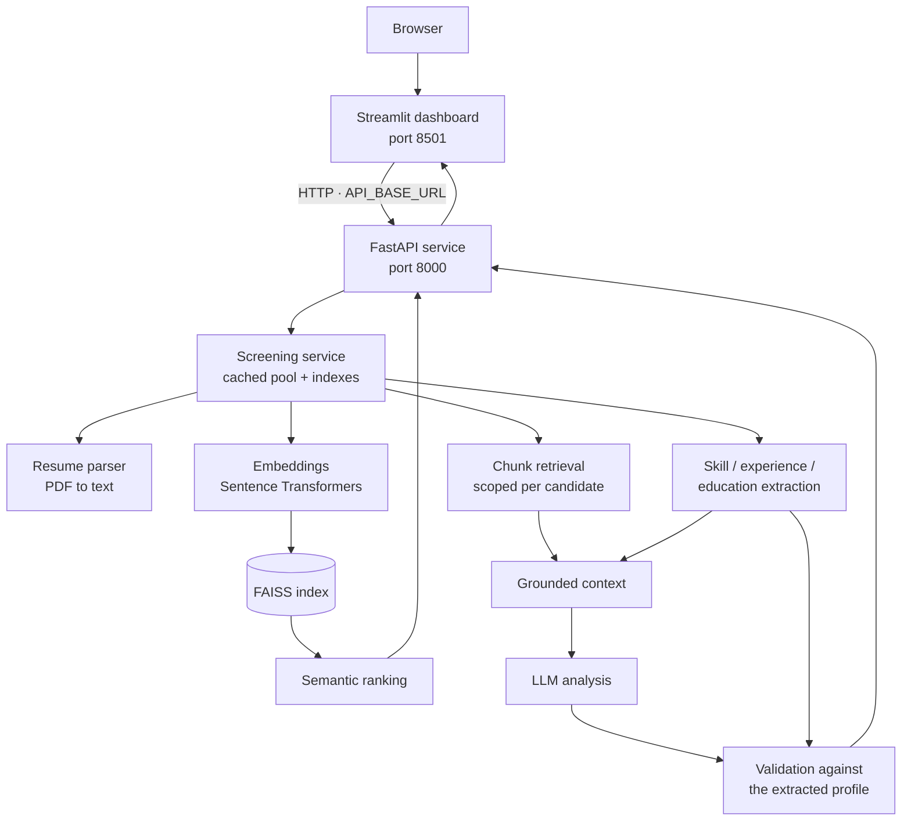

# Resume Screening & Candidate Matching System

A recruiter-facing tool that ranks candidates against a job description using
semantic search, extracts their skills and experience with deterministic rules,
and produces a written assessment grounded in passages retrieved from each
candidate's own resume.

It runs as two local services: a **FastAPI** backend that does the work, and a
**Streamlit** dashboard that talks to it over HTTP.

Everything runs locally. No API key is required — candidate analysis defaults to
an offline deterministic provider, so the whole application and its full test
suite work with no credentials and no network access after the first run.

---

## What it does

1. Reads PDF resumes and extracts clean text.
2. Embeds resumes and job descriptions, and ranks candidates by semantic
   similarity using a FAISS index.
3. Extracts skills, years of experience and degrees using a fixed taxonomy and
   explicit rules — no model, so the result is exact and explainable.
4. Retrieves the passages of a candidate's resume most relevant to the role.
5. Asks a language model to assess the candidate **using only** that retrieved
   material and the extracted profile.
6. Validates the response against the extracted profile, removing claims the
   resume does not support and recording every correction.
7. Presents all of it in a dashboard, with the source passages shown next to
   the generated text.

### Features

- Multi-file PDF upload, with per-file validation and clear rejection reasons.
- Semantic ranking across the whole candidate pool.
- Per-candidate analysis: matched skills, gaps, experience fit, education,
  written summary, and the evidence it rests on.
- Filtering, sorting and search over the ranked list, plus two charts.
- Resume pool management: remove one, remove several, or clear the pool.
- Screening sessions that reset the current role without deleting resumes.
- A REST API with generated OpenAPI documentation.
- A command-line interface for the same pipeline.
- 1321 automated tests; the whole suite runs offline.

### What it does not do

This is a decision-support tool, not an automated screener. It orders resumes
and summarises them for a human reviewer. It does not decide anything, its
scores are not calibrated, and its written output can be wrong in ways the
validation layer cannot catch. There is no authentication, and it is intended to
be run locally.

---

## Quick start

Windows PowerShell, from a clean clone:

```powershell
git clone <repository-url>
cd "LLM-Powered Resume Screening & Candidate Matching System"

python -m venv .venv
.\.venv\Scripts\Activate.ps1

pip install -r requirements.txt

copy .env.example .env          # optional; every setting has a default
python scripts\generate_sample_data.py

.\start_app.ps1
```

Then open **<http://localhost:8501>**.

| What | URL |
| --- | --- |
| **Dashboard** — start here | <http://localhost:8501> |
| API | <http://127.0.0.1:8000> |
| API documentation (Swagger UI) | <http://127.0.0.1:8000/docs> |
| API documentation (ReDoc) | <http://127.0.0.1:8000/redoc> |

Stop both services with:

```powershell
.\stop_app.ps1
```

### If PowerShell blocks the script

Windows may refuse to run a local script. This allows it **for the current
PowerShell window only**, and changes nothing permanently:

```powershell
Set-ExecutionPolicy -Scope Process -ExecutionPolicy Bypass
.\start_app.ps1
```

Closing the window undoes it. Avoid `-Scope CurrentUser` or `-Scope LocalMachine`
unless you intend a lasting change to your machine.

### If the scripts do not work at all

Start the two services by hand, in two separate terminals, backend first. Both
commands use `python -m` so they do not depend on `uvicorn` or `streamlit` being
on your `PATH`:

```powershell
# Terminal 1 — the API
.\.venv\Scripts\Activate.ps1
python -m uvicorn app.api.main:app --reload
```

```powershell
# Terminal 2 — the dashboard
.\.venv\Scripts\Activate.ps1
python -m streamlit run app/ui/dashboard.py
```

Note that `.env` is **only** loaded by `start_app.ps1`. When starting by hand,
set any variable you need in the shell first:

```powershell
$env:LLM_PROVIDER = "anthropic"
```

Stop a manually started service with `Ctrl+C` in its terminal.

---

## The first five minutes

A walk through the whole system, using the bundled sample data.

**1. Install and start.** Follow the Quick start above. The first start takes
about a minute: the API downloads the embedding model (~90 MB) on first use and
caches it, so later starts are fast.

**2. Open the dashboard** at <http://localhost:8501>. The sidebar should show
*API connected*. If it shows *API unreachable*, see [Troubleshooting](#troubleshooting).

**3. Look at the pool.** The **Resumes** page lists the sample candidates that
`generate_sample_data.py` created. They are fictional.

**4. Upload a resume.** On **Screening**, under *Candidate pool*, add any
text-based PDF and click *Add to pool*. It joins the pool and becomes rankable.
A scanned image is rejected with a reason — there is no OCR.

**5. Describe the role.** Still on **Screening**, paste a job description into
step 1 and save. `data/job_descriptions/financial_analyst.txt` is a good one to
start with. The more explicit it is about skills and required years, the more
there is to compare against.

**6. Rank the candidates.** Step 2. Every resume is scored against the role and
you land on the **Ranking** page — a table, a top-match callout, and a
similarity chart. Skill coverage and recommendation read *Not analyzed yet*,
because ranking and analysis are separate steps.

**7. Analyse a shortlist.** On **Ranking**, choose how many of the top
candidates to analyse and click *Analyze*. Each one costs a model call. The
table fills in with skill coverage, experience fit and a recommendation.

**8. Open a candidate.** Pick one and click *View full analysis*. You get four
distinct measures, matched skills and gaps, experience, education, the written
summary, and — at the bottom — the verbatim resume passages the model was shown.
Compare the summary against the evidence; that is the intended way to read it.

**9. Delete a resume.** On **Resumes**, remove one. It disappears from the pool
immediately and can no longer be ranked or analysed. *New screening session*
clears the current role and its results but keeps every resume.

**10. Run the tests.**

```powershell
python -m pytest
```

Expect `1316 passed, 5 skipped`. The [test section](#tests) explains the skips.

---

## Architecture

Two processes. The dashboard holds no application logic: it renders what the API
returns, and imports nothing from the API's internals — a test enforces that
boundary.



### The two services

| | Dashboard | API |
| --- | --- | --- |
| Command | `python -m streamlit run app/ui/dashboard.py` | `python -m uvicorn app.api.main:app --reload` |
| Default port | 8501 | 8000 |
| Package | `app/ui/` | `app/api/` |
| Reads resumes from disk | No | Yes |
| Loads the embedding model | No | Yes |
| Needs the other to work | Yes | No |

The dashboard finds the API through `API_BASE_URL`, which defaults to
`http://127.0.0.1:8000`. Point it elsewhere and the same dashboard drives a
backend on another machine. Every request goes through one module,
`app/ui/api_client.py`; no other UI file makes an HTTP call.

If the API is not running, the dashboard says so and shows how to start it
rather than displaying an empty screen.

### Pipeline stages

| Stage | Modules |
| --- | --- |
| 1. Ingestion — PDF to clean text | `resume_parser.py` |
| 2. Ranking — embed, index, compare | `embeddings.py`, `vector_store.py`, `matching.py` |
| 3. Extraction — skills, experience, education | `skill_taxonomy.py`, `skill_extractor.py`, `experience_extractor.py`, `education_extractor.py`, `candidate_analyzer.py` |
| 4. Retrieval — chunk and search, per candidate | `chunker.py`, `retriever.py` |
| 5. Generation — grounded prompt, model call | `rag_context.py`, `prompts.py`, `llm.py` |
| 6. Validation — check output against the profile | `analysis_parser.py`, `rag_pipeline.py` |
| 7. API | `app/api/` |
| 8. Dashboard | `app/ui/` |

Everything up to stage 5 is deterministic: the same resume and job description
always produce the same skills, the same experience verdict and the same
retrieved passages. Only the summary and recommendation are generated, and both
are validated before they are shown.

---

## Project walkthrough — the life of a candidate

```
PDF uploaded
   ↓  resume_parser.py          validate, extract text, normalise whitespace
resume text
   ↓  chunker.py                80-word windows, 20-word overlap
chunks
   ↓  embeddings.py             Sentence Transformers, L2-normalised vectors
vectors
   ↓  vector_store.py           FAISS index — one per candidate for retrieval,
   │                            one shared for ranking
   ↓  matching.py               cosine similarity against the job description
semantic rank
   ↓  skill_extractor.py        boundary-guarded matching against a taxonomy
   ↓  experience_extractor.py   only durations the resume states outright
   ↓  education_extractor.py    degrees found in the text
candidate profile
   ↓  retriever.py              passages closest to the role, this candidate only
   ↓  rag_context.py            job description + profile + evidence, nothing else
   ↓  prompts.py, llm.py        one model call
raw response
   ↓  analysis_parser.py        unsupported claims removed and recorded
validated analysis
   ↓  app/api/routes.py         rendered as JSON
   ↓  app/ui/pages.py           rendered for the recruiter
```

Two properties are enforced structurally rather than by convention:

- **Candidate isolation.** Each candidate's chunks live in their own FAISS
  index, so a search scoped to one candidate physically cannot reach another's
  text. A filter could have a bug; a separate index cannot.
- **Grounding.** The model receives only the job description, the deterministic
  profile and that candidate's retrieved passages. What comes back is checked
  against the profile: skills the resume does not support are removed, invented
  durations and degrees are flagged, and a recommendation outside the fixed
  vocabulary becomes `INSUFFICIENT_INFORMATION`. Corrections are listed in
  `warnings`, and `is_grounded` is false whenever any were needed.

This reduces hallucination. It does not eliminate it — see
[Known limitations](#known-limitations).

---

## The four measures

A candidate ends up with four figures. They come from different places and
regularly disagree; that disagreement is information.

| | What it measures | Where it comes from | Displayed as |
| --- | --- | --- | --- |
| **Semantic similarity** | How alike the resume and the job description read in embedding space | Measured — cosine similarity | `59.35%` |
| **Skill coverage** | How many named requirements appear on the resume | Extracted — deterministic, fixed taxonomy | `11 / 12` |
| **Experience** | Whether stated years meet stated years | Extracted — three-way; unknown stays unknown | `Requirement met` |
| **Recommendation** | A coarse overall assessment | Generated by the model, then validated | `Strong match` |

**similarity ≠ skill coverage ≠ recommendation.** A candidate can read as highly
similar while covering few requirements — usually a resume written in the same
register as the job description without the substance behind it. The dashboard
shows all four side by side for that reason.

### About the percentage

Similarity is stored and returned by the API as a raw cosine value in `[-1, 1]`,
for example `0.5935`. The dashboard displays `59.35%` because that is easier to
scan. **The percent sign is a readability convention for a value that runs 0–1,
not a probability.** The wording shown beside it says so:

> Semantic similarity between the job description and candidate resume
> embeddings. This is a ranking signal, not a hiring probability or percentage
> of requirements met.

The candidate detail view also shows the raw cosine value. No stored or
API-returned number is scaled.

---

## Technology stack

| Area | Choice |
| --- | --- |
| Language | Python 3.11+ (developed and tested on 3.12) |
| PDF extraction | PyMuPDF |
| Embeddings | Sentence Transformers — `all-MiniLM-L6-v2` |
| Vector search | FAISS (`faiss-cpu`) |
| Numerics | NumPy |
| Skill / experience / education extraction | Standard library only |
| Language model | Provider abstraction; offline deterministic default, optional Anthropic API |
| API | FastAPI, Pydantic v2 |
| ASGI server | Uvicorn |
| Dashboard | Streamlit, with Altair and pandas (both arrive with Streamlit) |
| HTTP client | httpx |
| Tests | pytest |

Ten direct dependencies, all pinned in `requirements.txt`. The Anthropic SDK and
LangChain are optional and not installed by default.

---

## Repository structure

```
.
├── app/
│   ├── api/                     FastAPI layer
│   │   ├── main.py              application factory; uvicorn entry point
│   │   ├── routes.py            endpoints
│   │   ├── schemas.py           request/response models
│   │   ├── service.py           cached pool, indexes, candidate lookup
│   │   ├── dependencies.py      shared FastAPI dependencies
│   │   ├── config.py            settings from the environment
│   │   └── errors.py            consistent error responses
│   │
│   ├── ui/                      Streamlit layer (an API client)
│   │   ├── dashboard.py         streamlit entry point
│   │   ├── pages.py             the five screens
│   │   ├── components.py        cards, badges, charts, states
│   │   ├── api_client.py        the only module that speaks HTTP
│   │   ├── formatting.py        display helpers
│   │   ├── state.py             session state
│   │   ├── theme.py             design tokens and stylesheet
│   │   └── config.py            settings from the environment
│   │
│   ├── resume_parser.py         PDF to text
│   ├── embeddings.py            text to vectors
│   ├── vector_store.py          FAISS index plus metadata
│   ├── matching.py              candidate ranking
│   │
│   ├── skill_taxonomy.py        skill vocabulary
│   ├── skill_extractor.py       skill extraction and comparison
│   ├── experience_extractor.py  stated years of experience
│   ├── education_extractor.py   degrees
│   ├── candidate_analyzer.py    builds candidate profiles
│   │
│   ├── chunker.py               resume chunking
│   ├── retriever.py             per-candidate chunk retrieval
│   ├── rag_context.py           grounded context assembly
│   ├── prompts.py               prompt templates and grounding rules
│   ├── llm.py                   provider abstraction
│   ├── analysis_parser.py       parses and validates model output
│   ├── rag_pipeline.py          end-to-end orchestration
│   │
│   ├── models.py                shared records
│   └── main.py                  command-line interface
│
├── data/
│   ├── job_descriptions/        sample descriptions (committed, fictional)
│   └── resumes/                 candidate PDFs (contents git-ignored)
│
├── scripts/
│   └── generate_sample_data.py  writes fictional sample resumes
│
├── tests/                       1321 tests
├── .streamlit/config.toml       dashboard base theme
├── start_app.ps1                start both services
├── stop_app.ps1                 stop both services
├── .env.example                 documented configuration template
├── requirements.txt
├── pytest.ini
└── README.md
```

---

## Prerequisites

- **Python 3.11 or newer.** Check with `python --version`.
- **pip**, included with Python.
- **Git**, to clone the repository.
- **About 2 GB of disk space.** Installing dependencies pulls in PyTorch, and
  the embedding model adds another ~90 MB on first run.
- **Internet access for the first run only** — to install packages and download
  the embedding model. Everything works offline afterwards.
- **Windows PowerShell** for the start/stop scripts. The application itself is
  cross-platform; only those two scripts are Windows-specific.

No API key, database, container runtime or external service is required.

---

## Installation

### 1. Clone and enter the repository

```powershell
git clone <repository-url>
cd "LLM-Powered Resume Screening & Candidate Matching System"
```

### 2. Create and activate a virtual environment

```powershell
python -m venv .venv
.\.venv\Scripts\Activate.ps1
```

Your prompt should now begin with `(.venv)`. If activation is blocked, see
[If PowerShell blocks the script](#if-powershell-blocks-the-script).

`.venv/` is git-ignored.

> **Windows path length.** If installation fails with `[WinError 206] The
> filename or extension is too long`, the culprit is PyTorch's deeply nested
> files under a long project path. Either enable long paths
> (`Set-ItemProperty 'HKLM:\SYSTEM\CurrentControlSet\Control\FileSystem' -Name LongPathsEnabled -Value 1`,
> as Administrator, then reboot), or create the virtual environment somewhere
> shorter, for example `python -m venv C:\venvs\resume-screening`.

### 3. Install dependencies

```powershell
pip install -r requirements.txt
```

This installs roughly 1.5 GB of packages, PyTorch being most of it.

### 4. Configure (optional)

```powershell
copy .env.example .env
```

Every setting has a working default, so this step is optional. See
[Configuration](#configuration).

### 5. Generate sample data

```powershell
python scripts\generate_sample_data.py
```

Writes nine fictional resumes into `data/resumes/`. Skip this if you intend to
upload your own.

### 6. Verify the installation

```powershell
python -m pytest
```

Expect `1316 passed, 5 skipped`. The first run is slower because one test group
loads the embedding model.

---

## Configuration

Every variable is optional; the project runs with no configuration at all.
`.env.example` documents each one with its default.

`start_app.ps1` loads `.env` into the environment before starting the services.
Nothing else reads the file — the application reads environment variables — so
when starting a service by hand, set variables in your shell instead:

```powershell
$env:LLM_PROVIDER = "anthropic"
python -m uvicorn app.api.main:app --reload
```

A value already set in the shell always takes precedence over `.env`.

| Variable | Required | Purpose | Default |
| --- | --- | --- | --- |
| `RESUME_DIR` | No | Directory scanned for candidate PDFs | `data/resumes` |
| `EMBEDDING_MODEL` | No | Sentence Transformers model id | `sentence-transformers/all-MiniLM-L6-v2` |
| `LLM_PROVIDER` | No | `fake`, `anthropic` or `langchain` | `fake` |
| `LLM_MODEL` | No | Model id for the chosen provider | `claude-opus-5` |
| `LLM_API_KEY` | Only for `anthropic` | API key; `ANTHROPIC_API_KEY` also accepted | *(empty)* |
| `LLM_MAX_TOKENS` | No | Response cap | `4096` |
| `API_CORS_ORIGINS` | No | Allowed browser origins, comma separated | dashboard on 8501 |
| `API_MAX_UPLOAD_BYTES` | No | Upload size ceiling | `5242880` (5 MB) |
| `API_LOG_LEVEL` | No | Level for the application logger | `INFO` |
| `API_BASE_URL` | No | Where the dashboard looks for the API | `http://127.0.0.1:8000` |
| `API_TIMEOUT_SECONDS` | No | Timeout for ordinary API calls | `30` |
| `API_ANALYSIS_TIMEOUT_SECONDS` | No | Timeout for analysis calls | `180` |
| `UI_DEFAULT_TOP_K` | No | Candidates the ranking asks for | `10` |

**`.env` must never be committed.** It is git-ignored, and it is where a real
key would live. `.env.example` is committed and must stay free of credentials.

### Using a real language model

Candidate analysis runs offline by default against a deterministic provider that
needs no key. Its output is labelled `fake/deterministic-v1` so it is never
mistaken for model prose. To use the Anthropic API instead:

```powershell
pip install anthropic==1.0.0

# In .env (git-ignored), or in your shell:
$env:LLM_PROVIDER = "anthropic"
$env:LLM_API_KEY  = "sk-ant-..."

.\start_app.ps1
```

Only candidate analysis uses the model. Parsing, ranking and extraction never
do, so they stay free and offline regardless.

LangChain is supported from Python: `app/llm.py` provides `LangChainProvider`,
which wraps any LangChain chat model. Nothing imports LangChain unless you
choose to use it.

---

## Running and stopping

### With the scripts

```powershell
.\start_app.ps1                              # default ports 8000 and 8501
.\start_app.ps1 -ApiPort 8100 -UiPort 8600   # different ports
.\stop_app.ps1
```

`start_app.ps1`:

- finds a usable Python — `$env:PYTHON`, then an active virtual environment,
  then `.venv` in the project, then `python` on `PATH`;
- loads `.env` if present;
- verifies the required packages are importable, and stops with an actionable
  message if they are not;
- starts both services, waits for each to answer a health check, and prints the
  URLs;
- is safe to run twice — a service already up is reported and left alone;
- refuses to start a service whose port is held by something else, and tells you
  which port to change.

`stop_app.ps1` stops **only** what `start_app.ps1` started. It records each
process id and its start time in `.run/`, and verifies both before stopping
anything, because Windows reuses process ids. It stops child processes first —
`uvicorn --reload` runs the application in a child that would otherwise be
orphaned holding the port. It never matches processes by image name, so it
cannot touch another project's Python, and it is safe to run when nothing is
running.

Logs and process state live in `.run/`, which is git-ignored.

### By hand

See [If the scripts do not work at all](#if-the-scripts-do-not-work-at-all).

### The command line

The same pipeline is available without either service:

```powershell
python -m app.main extract data\resumes\sarah_wilson.pdf
python -m app.main match   --job-description data\job_descriptions\financial_analyst.txt
python -m app.main analyze --job-description data\job_descriptions\financial_analyst.txt
python -m app.main rag     --job-description data\job_descriptions\financial_analyst.txt
```

---

## Using the application

### Uploading resumes

On **Screening → Candidate pool**, select one or more PDFs and add them. Each
file is streamed to the API, validated and parsed; only files that parse are
kept. The response reports how much text was extracted.

- **PDF only**, checked by file extension *and* by the leading `%PDF` bytes.
- **Size-capped** at `API_MAX_UPLOAD_BYTES` (5 MB by default), enforced while
  streaming, so an oversized file is abandoned rather than buffered.
- **Text-based PDFs only.** A scanned image has no selectable text and is
  rejected with that explanation. There is no OCR.
- **The stored name is generated**, never taken from the upload: the submitted
  name is reduced to a slug of `[a-z0-9_]`, which becomes the candidate id.
  `Sarah Wilson (CV).pdf` becomes `sarah_wilson_cv`. Re-uploading a file whose
  name reduces to the same id replaces the earlier one.

Uploads are stored on the machine running the API, in `RESUME_DIR`. Contents of
that directory are git-ignored.

### Managing the pool

The **Resumes** page lists everything stored, and offers:

- **Remove** on any row — deletes that resume immediately.
- **Multi-select removal** — tick several, remove them in one call. One failure
  does not abandon the rest; each is reported.
- **Clear resume pool** — deletes every stored resume, behind a confirmation.
  Only files that are currently pooled candidates are touched; anything else in
  the directory is left alone.

Deletion is permanent: the file is unlinked, and there is no undo.

Removing a resume drops the cached pool and both FAISS indexes on the server, so
the candidate stops appearing in rankings and can no longer be analysed. In the
dashboard it also drops that candidate's analysis and the whole ranking, whose
ranks and totals described a pool that has now changed. The job description
survives — deleting a resume is not abandoning the role.

**New screening session** clears the job description, the ranking, the analyses
and the selection, and **keeps every resume**. The pool is shared across
sessions; emptying it is the separate, confirmed action above.

### Matching

Paste a job description, choose how many candidates to rank, and rank. The API
embeds the description and compares it against the resume index, returning
candidates ordered by cosine similarity. Resumes are parsed and embedded once
and reused, so repeat rankings only re-embed the description — a few tens of
milliseconds.

The ranked table carries rank, name, similarity, a word for the similarity band,
skill coverage, experience status and recommendation. The last three read *Not
analyzed yet* until that candidate has been analysed. Search, filter by
recommendation, filter by minimum similarity, and sort by any of four orders.

### Analysis

Analysis is separate from ranking because it costs a model call per candidate.
Choose how many of the top candidates to analyse; already-analysed candidates
are skipped.

For each one the system retrieves the passages of that candidate's resume
closest to the role, assembles them with the extracted profile into a prompt,
calls the model, and validates the response. The candidate detail view shows the
four measures, matched skills and gaps, experience, education, the written
summary, and the retrieved passages.

Evidence and generated text are rendered differently on purpose: retrieved
resume text is monospaced on a tinted ground behind a solid rule and labelled
*From resume*; the model's prose sits on a white card behind a dashed rule
labelled *AI-generated interpretation*, with the model name beneath it.

---

## API

Base URL `http://127.0.0.1:8000` by default. Interactive documentation is served
at **`/docs`** (Swagger UI) and **`/redoc`** (ReDoc); the raw schema is at
`/openapi.json`.

Every error uses the same shape:

```json
{ "detail": "Only PDF files are supported.", "code": "unsupported_file_type" }
```

A `422` adds an `errors` array naming the offending fields. Tracebacks,
filesystem paths and internal exception text are never returned.

| Status | Meaning |
| --- | --- |
| `400` | The request or the file is unusable |
| `404` | Unknown candidate, or the resume directory is missing or empty |
| `413` | Upload exceeds `API_MAX_UPLOAD_BYTES` |
| `422` | Request validation failed |
| `500` | Unexpected server-side failure |
| `502` | The language model provider failed or returned something unusable |

### `GET /health`

Liveness. Loads no model and reads no resume.

```json
{ "status": "healthy", "service": "resume-screening-api",
  "version": "0.1.0", "llm_provider": "fake" }
```

Never reveals whether a key is configured.

### `GET /candidates`

Lists the pool. Files that could not be parsed appear under `unreadable` rather
than being silently omitted.

```json
{ "candidates": [ { "candidate_id": "sarah_wilson", "name": "Sarah Wilson",
                    "filename": "sarah_wilson.pdf", "text_length": 1987 } ],
  "count": 1, "unreadable": [] }
```

An existing but empty directory returns an empty list. A missing directory is a
`404` (`resume_directory_not_found`).

### `POST /upload-resume`

`multipart/form-data`. Fields: `file` (the PDF, required) and `store` (boolean,
default `false`).

With `store=false` the file is parsed and discarded. With `store=true` it is kept
as a rankable candidate — this is what the dashboard sends.

```powershell
curl.exe -X POST http://127.0.0.1:8000/upload-resume `
  -F "file=@data/resumes/sarah_wilson.pdf" -F "store=true"
```

```json
{ "filename": "sarah_wilson.pdf", "status": "success", "text_length": 1987,
  "word_count": 269, "preview": "Sarah Wilson\nSenior Financial Analyst...",
  "stored": true, "candidate_id": "sarah_wilson" }
```

Common errors: `400 unsupported_file_type` (not a PDF), `400 invalid_pdf`
(corrupt), `400 no_extractable_text` (scanned image), `400 empty_file`,
`413 payload_too_large`, `422` (no file supplied).

### `POST /match-candidates`

```json
{ "job_description": "Financial analyst with 3+ years...", "top_k": 5 }
```

`top_k` is optional, defaults to `5`, and must be between 1 and 100.

```json
{ "results": [ { "rank": 1, "candidate": "Sarah Wilson",
                 "candidate_id": "sarah_wilson", "similarity_score": 0.5129 } ],
  "count": 1, "candidates_considered": 9,
  "score_type": "cosine_similarity", "score_note": "..." }
```

`similarity_score` is the raw cosine value. `score_note` carries the explanation
of what it is not, so a client cannot display the number without it.

Common errors: `422` (empty or missing job description, `top_k` out of range),
`404 no_resumes` (empty pool), `404 resume_directory_not_found`.

### `POST /analyze-candidate`

```json
{ "candidate": "sarah_wilson", "job_description": "Financial analyst..." }
```

`candidate` may be a candidate id, a display name or a resume file name. It is
resolved against the pool and never treated as a path; a value containing `/`,
`\` or a null byte is rejected with `422`.

The response carries `recommendation`, `summary`, `matched_skills`,
`skill_gaps`, `experience_assessment`, `education`, `evidence`, `limitations`,
`warnings`, `is_grounded` and `model`.

The request has no field through which a client could supply skills, experience
or evidence, so it cannot bypass the grounding checks.

Common errors: `404 candidate_not_found`, `422` (blank fields, path-shaped
candidate), `502 llm_call_failed`, `502 llm_response_invalid`.

This is the slowest endpoint — it makes one model call. Allow for that in client
timeouts.

### `DELETE /candidates/{candidate_id}`

Removes one candidate and refreshes the pool. The path parameter is resolved
against the pool, never used to build a filesystem path.

```json
{ "deleted": ["james_patel"], "failed": [], "remaining": 8 }
```

Common error: `404 candidate_not_found`.

### `POST /candidates/delete`

Removes several. A `POST` rather than a `DELETE` because it carries a body, which
many HTTP clients and proxies will not send on a `DELETE`.

```json
{ "candidates": ["james_patel", "nina_volkov"] }
```

One failure does not abandon the batch: `deleted` names what went, `failed` says
what stayed and why.

### `DELETE /candidates`

Empties the pool. Only files that are currently pooled candidates are deleted.
Clearing an already-empty pool is not an error.

---

## Tests

```powershell
python -m pytest                 # everything; runs offline
python -m pytest -q              # quieter
python -m pytest tests\test_api_matching.py      # one file
python -m pytest -m "not model"  # skip tests that load the embedding model
python -m pytest -m model        # only those tests
python -m pytest -m llm          # only tests needing a real model provider
```

Expected result: **1316 passed, 5 skipped**.

### Why five tests skip

The five skipped tests live in `tests/test_real_llm.py` and are marked `llm`.
They exercise the real Anthropic provider, so they need credentials and the
optional SDK, and they skip themselves with this reason:

```
no real LLM configured; set LLM_PROVIDER=anthropic and LLM_API_KEY
(and pip install anthropic) to run these
```

Skipping is the designed behaviour, not a failure: the suite must pass with no
key and no network. To run them, install `anthropic`, set `LLM_PROVIDER` and
`LLM_API_KEY`, and run `python -m pytest -m llm`. Doing so makes real API calls,
which cost money.

Two markers are declared in `pytest.ini`:

- `model` — needs the real Sentence Transformers weights; downloads on first
  run and skips if unavailable.
- `llm` — needs a real provider and credentials.

The rest of the suite runs against a deterministic bag-of-words embedder and the
offline model provider, so it is fast, offline and reproducible. No test opens a
socket, needs a key, or touches your real `data/resumes/` directory.

---

## Local data and version control

| Path | Committed? | What it is |
| --- | --- | --- |
| `app/`, `tests/`, `scripts/` | Yes | Source code |
| `data/job_descriptions/` | Yes | Fictional sample job descriptions |
| `data/resumes/.gitkeep` | Yes | Keeps the directory; its contents are ignored |
| `data/resumes/*.pdf` | **No** | Uploaded and generated resumes — may contain personal data |
| `.streamlit/config.toml` | Yes | Dashboard base theme; project configuration |
| `.env.example` | Yes | Configuration template, no credentials |
| `.env` | **No** | Your local configuration, including any API key |
| `.venv/` | **No** | Virtual environment |
| `.run/` | **No** | Process ids and service logs from `start_app.ps1` |
| `.claude/` | **No** | Local editor tooling |
| `__pycache__/`, `.pytest_cache/` | **No** | Generated caches |

Resume PDFs are never committed. Real resumes contain personal data, so
`data/resumes/` keeps only a `.gitkeep`, and everything in it is ignored. The
bundled sample resumes are fictional and are generated locally by
`scripts/generate_sample_data.py` rather than stored in the repository.

To reset your local pool, delete the PDFs and regenerate:

```powershell
Remove-Item data\resumes\*.pdf
python scripts\generate_sample_data.py
```

---

## Troubleshooting

**`uvicorn is not recognized` / `streamlit is not recognized`**
The console scripts are not on your `PATH`, usually because the virtual
environment is not active. Activate it, or use the module form, which does not
depend on `PATH` at all:

```powershell
python -m uvicorn app.api.main:app --reload
python -m streamlit run app/ui/dashboard.py
```

**`ModuleNotFoundError: No module named 'fastapi'` (or `streamlit`, `fitz`, `faiss`)**
Dependencies are missing from the interpreter you are using. Activate the
virtual environment and install:

```powershell
.\.venv\Scripts\Activate.ps1
pip install -r requirements.txt
```

Confirm you are using the right interpreter with `python -c "import sys; print(sys.executable)"`.

**Virtual environment not activated**
Your prompt does not start with `(.venv)`. Run `.\.venv\Scripts\Activate.ps1`
from the project root. Each new terminal needs its own activation.

**`cannot be loaded because running scripts is disabled on this system`**
PowerShell's execution policy. Allow scripts for this window only:

```powershell
Set-ExecutionPolicy -Scope Process -ExecutionPolicy Bypass
```

**`Port 8000 is in use by something else`**
`start_app.ps1` refuses to start a service on an occupied port. Either free it,
or choose another:

```powershell
.\start_app.ps1 -ApiPort 8100 -UiPort 8600
```

To see what holds a port:

```powershell
Get-NetTCPConnection -LocalPort 8000 -State Listen |
  Select-Object OwningProcess
```

After force-stopping a service, Windows can leave the socket attributed to the
dead process for a few seconds; wait, then retry.

**Dashboard says `API unreachable`**
The dashboard is a client and has nothing to show without the API. Check that
the API is up:

```powershell
curl.exe http://127.0.0.1:8000/health
```

If it is running on a different port, tell the dashboard where to look by
setting `API_BASE_URL` (in `.env` when using `start_app.ps1`, or in the shell
when starting by hand). Service logs are in `.run/api.log` and `.run/api.log.err`.

**First request is very slow, or times out**
The first request loads the Sentence Transformers model and, on a fresh
install, downloads it (~90 MB). Expect up to a minute. Later requests are fast
because the model and the index stay in memory. The dashboard's analysis
timeout is 180 seconds by default (`API_ANALYSIS_TIMEOUT_SECONDS`).

**Missing `.env`**
Not a problem — every setting has a default and the project runs without one.
Create it only when you want to change something:
`copy .env.example .env`.

**Missing LLM credentials**
Also not a problem. Analysis falls back to the offline deterministic provider,
whose output is labelled `fake/deterministic-v1`. If you set
`LLM_PROVIDER=anthropic` without a key, or without `pip install anthropic`, the
API answers with a clear error rather than failing silently.

**An uploaded resume does not appear**
Check the upload result message — a rejected file says why. Most often the PDF
is a scanned image with no selectable text, which this system cannot read.
Confirm what the server holds with:

```powershell
curl.exe http://127.0.0.1:8000/candidates
```

Also confirm you are looking at the right directory: the API reads `RESUME_DIR`,
which defaults to `data/resumes` **relative to where the API process was
started**.

**A deleted resume still appears in the ranking**
The ranking in your browser is a snapshot taken before the deletion. Re-rank on
the Screening page. Server-side, deleting always drops the cached pool and both
FAISS indexes, so the API itself will not return a deleted candidate.

**Resetting everything**

```powershell
.\stop_app.ps1
Remove-Item data\resumes\*.pdf
Remove-Item .run -Recurse -Force
python scripts\generate_sample_data.py
.\start_app.ps1
```

---

## Security notes

- **No authentication.** Anyone who can reach the ports can use every endpoint,
  including the one that costs a model call, and can delete resumes. Run it
  locally; do not expose it to an untrusted network.
- **No path is ever accepted from a client.** Uploads are written to generated
  names in `RESUME_DIR`; a candidate reference is looked up in the pool and
  rejected if it contains `/`, `\` or a null byte; deletion re-checks that the
  resolved file sits inside the configured directory before unlinking.
- **Uploads are validated** by extension and by leading bytes, size-capped
  while streaming, and written to temporary files that are removed in a
  `finally` block.
- **Errors reveal nothing internal.** No traceback, filesystem path,
  environment variable or 5xx exception text reaches a client. Server-side
  failures are logged in full and answered with a fixed message.
- **Logs exclude sensitive content.** Endpoints, file names, sizes and outcomes
  are logged; resume text, candidate details and credentials are not.
- **Credentials come from the environment only.** Nothing writes a key to disk
  or logs one. `.env` is git-ignored; `.env.example` contains no real values.
- **CORS is restricted** to the dashboard's origin by default. `*` is available
  for development and is documented as such.
- **Resume data is personal data.** Uploaded PDFs stay on the machine running
  the API and are never committed. Treat `data/resumes/` accordingly.

---

## Known limitations

**Extraction**
Scanned or image-only PDFs yield no text; there is no OCR. Multi-column layouts
extract in PyMuPDF's reading order, which can interleave columns. Skill
extraction only recognises skills present in its taxonomy, so an unusual
phrasing or an unlisted technology is missed. Years of experience are read only
where the resume states them outright — never inferred from employment dates or
a graduation year.

**Ranking**
Similarity is a single number from a small embedding model. It cannot filter on
hard requirements, and it cannot justify a ranking. The embedding model
truncates at 256 word pieces, which is why retrieval chunks resumes rather than
embedding them whole. Scores are comparable only within one ranking.

**Analysis**
Hallucination is reduced, not eliminated. Unsupported skills, invented durations,
invented degrees and out-of-vocabulary recommendations are caught and corrected.
Invented employers, projects and achievements are not — there is no ground truth
to check them against. Fluent, subtly wrong prose can survive. Retrieval can miss
the passage that would have answered a requirement. The recommendation is a
coarse label, not a calibrated measurement.

**Operational**
State is in-process: one server holds one pool in memory, and a second worker
would hold its own copy. Nothing is persisted beyond the PDFs themselves —
analyses live in the browser session and are lost on reload. Analysis is
synchronous, so a request holds a connection for the whole model call, and there
is no queue and no cancellation. The pool is shared by every user of the
dashboard, with no per-recruiter workspace, and deletion is permanent with no
undo. The first request after start-up is slow.

**Fairness**
Embedding similarity reflects patterns in the model's training data and can
carry those biases; a generated summary can carry them too. The output is
intended to order and summarise resumes for a human reviewer, never to screen
automatically.

---

## Reference

The sections below document each part of the pipeline in depth — what it does,
why it was built that way, and what it cannot do. They are not needed to run the
project.

## Sample data

Generate a set of fictional resumes to try things out:

```bash
python scripts/generate_sample_data.py
```

That writes nine invented candidates into `data/resumes/` — six technical
profiles plus three finance ones (a strong, a partial and a poor match) used to
demonstrate Phase 3. The folder is
git-ignored (except `.gitkeep`), so neither the samples nor any real candidate
resume ever reaches version control. Sample job descriptions live in
`data/job_descriptions/` and are committed, since they contain no personal data.

## Phase 1 — extracting text from one resume

```bash
python -m app.main extract data/resumes/priya_sharma.pdf
```

The Phase 1 form without a subcommand still works and means the same thing:

```bash
python -m app.main data/resumes/priya_sharma.pdf
```

Write the result to a file instead of the terminal:

```bash
python -m app.main extract data/resumes/priya_sharma.pdf -o output/priya.txt
```

### Expected output

```
$ python -m app.main extract data/resumes/priya_sharma.pdf
Priya Sharma
Senior Python Backend Engineer
priya.sharma@example.com | Bengaluru, India
SUMMARY
Backend engineer with 8 years building scalable Python microservices
and REST APIs on AWS. Strong focus on distributed systems and
database performance.
...
```

Blank lines are stripped: PDFs encode visual spacing as coordinates, not as
empty text lines, so the normalizer has nothing to preserve there. Section
headings still land on their own lines.

## Phase 2 — ranking candidates against a job description

```bash
python -m app.main match --job-description data/job_descriptions/backend_engineer.txt
```

Useful options:

```bash
# Inline job description instead of a file
python -m app.main match --job-text "Senior Python backend engineer, FastAPI and PostgreSQL"

# A different resume folder, top 3 only
python -m app.main match -r data/resumes -j data/job_descriptions/ml_engineer.txt -k 3
```

### Example output

```
$ python -m app.main match --job-description data/job_descriptions/backend_engineer.txt
Embedding 6 resume(s) with sentence-transformers/all-MiniLM-L6-v2 ...
Rank  Candidate        Similarity
----  ---------------  ----------
   1  Priya Sharma         0.7851
   2  David Kim            0.6705
   3  Marcus Chen          0.4753
   4  Elena Rodriguez      0.3991
   5  Aisha Okafor         0.3540
   6  Tom Baker            0.1528
```

Priya (Python backend) tops a backend role and Tom (pastry chef) sits last.
Swap in `ml_engineer.txt` and Marcus Chen moves to rank 1 — the ranking follows
the job description, which is the whole point of matching on meaning.

## How Phase 2 works

### What "semantic matching" means

Keyword matching asks *does this resume contain the word "Python"?* It misses a
resume that says "Django" but never spells out "backend", and it is fooled by a
resume that lists a keyword once in passing.

Semantic matching compares *meaning* instead. Each document becomes a point in a
high-dimensional space, positioned so that texts about similar things land near
each other. "Built REST APIs in Django" ends up close to "Python backend
development" even with no shared words.

### How embeddings work, briefly

An embedding model reads text and outputs a fixed-length vector of numbers — 384
of them for the model used here. The model was trained so that sentence pairs
meaning the same thing produce vectors pointing in similar directions.
"Direction" is the operative word: similarity is measured as the **cosine of the
angle** between two vectors, which ignores length and captures only orientation.

### Why Sentence Transformers

Raw transformer models such as BERT produce one vector per token, and naively
averaging them compares poorly. Sentence Transformers models are fine-tuned
specifically so that a single vector represents a whole passage and cosine
similarity between two such vectors is meaningful.

The default is `sentence-transformers/all-MiniLM-L6-v2`: 384 dimensions, ~90 MB,
fast enough on CPU for local development, and a well-established general-purpose
baseline. Override it with `--model`.

### Why FAISS

FAISS is a similarity-search library for dense vectors. This project uses
`IndexFlatIP`, an exact inner-product index.

Because the embeddings are **L2-normalized when generated**, the inner product
between two vectors *is* their cosine similarity. That means the number FAISS
returns is used directly as the score — **no rescaling or transformation is
applied**. Exact search is the right default at this scale: for hundreds or
thousands of resumes it is fast, needs no training step, and unlike the
approximate indexes (IVF, HNSW) it never misses a relevant candidate. The index
is in-memory only; persistence is deliberately left for a later phase.

### How ranking works

1. Every resume PDF in the folder is parsed to text (Phase 1).
2. All resume texts are embedded in **one batched call**.
3. The vectors go into a FAISS index, each carrying its `Candidate` as metadata.
4. The job description is embedded with the same model.
5. FAISS returns the nearest resume vectors, sorted by descending similarity.
6. Each hit becomes a `MatchResult` with a 1-based `rank`.

### What the similarity score means — and does not

`similarity_score` is the cosine similarity between the job-description
embedding and the resume embedding.

- **Range.** Mathematically `[-1.0, 1.0]`. In practice this model maps English
  prose into a narrow cone, so on the sample data a strong match scores about
  `0.70–0.80`, a loosely related profile `0.35–0.50`, and an unrelated one
  around `0.15`.
- **It is a semantic similarity score.** It measures how close two pieces of
  text are in the embedding space.
- **It is not a probability of being hired**, not a percentage of requirements
  met, and not a measure of candidate quality. It is deliberately reported as a
  raw score rather than dressed up as a percentage, because scaling it to
  "78% match" would imply a statistical meaning it does not have.
- **Only relative ordering within one run is meaningful.** Absolute values are
  not comparable across different job descriptions.

## Phase 3 — analysing candidates

```bash
python -m app.main analyze --job-description data/job_descriptions/financial_analyst.txt
```

Same options as `match`, plus `--show-extra-skills` to list skills the job did
not ask for:

```bash
python -m app.main analyze -j data/job_descriptions/financial_analyst.txt -k 3
python -m app.main analyze -t "Financial analyst, 3+ years, Python and SQL" --show-extra-skills
```

### Example output

```
JOB REQUIREMENTS
  Required Skills: Python, SQL, Excel, Power BI, Tableau, Data Analysis, ...
  Minimum Experience: 3 years

CANDIDATES

2. Sarah Wilson
  Semantic Match Score: 0.5940
  Matched Skills:
    - Python
    - SQL
    - Excel
    - Power BI
    - Tableau
    ...
  Missing Skills:
    - Investment Analysis
  Skill Coverage: 12/13 required skills (92%)
  Experience:
    Candidate: 4 years
    Required:  3 years
    Requirement Met: Yes
  Education:
    MBA - Finance
    Bachelor of Commerce - Accounting

3. James Patel
  Semantic Match Score: 0.4416
  Skill Coverage: 4/13 required skills (31%)
  Experience:
    Candidate: 2 years
    Required:  3 years
    Requirement Met: No

8. Nina Volkov
  Semantic Match Score: 0.1491
  Matched Skills: none
  Skill Coverage: 0/13 required skills (0%)
  Experience:
    Candidate: not stated on resume
    Required:  3 years
    Requirement Met: Unknown
      (unknown is reported as unknown, not as a pass or a fail)
```

Note that Sarah is ranked **2**, not 1, by semantic similarity, yet covers 92% of
the required skills and clears the experience bar. This is exactly why Phase 3
exists: a single similarity number cannot tell you *which* requirements a
candidate meets, and the candidate the embedding likes most is not always the
one who best fits the stated requirements. The two views are complementary, and
both are shown.

## How Phase 3 works

### Skill extraction

Extraction is exact matching against a fixed vocabulary — no model, no
statistics. The same resume always yields the same skills, and every hit can be
traced to the substring that produced it (`SkillExtractor.find_mentions` returns
the matched text and its offsets).

Naive substring matching would be badly wrong here. `"SQL" in text` reports SQL
for *PostgreSQL*, *MySQL* and *sqlalchemy*; `"R"` reports R for every word
containing the letter. Each alias is therefore compiled into a regex with custom
boundaries:

| Guard | Effect |
| --- | --- |
| `(?<![A-Za-z0-9+#&])` before | *MySQL* does not yield SQL; *R&D* does not yield R |
| `(?![A-Za-z0-9+#&])` after | *C++* does not yield C; *sqlalchemy* does not yield SQL |
| `(?!\.\w)` after | *Node.js* does not yield Node, while *"Python."* still yields Python |

`\b` alone cannot do this: it is defined in terms of `\w`, so it misbehaves
around `+`, `#` and `.` — precisely the characters real skill names contain.

Two further rules:

- Matching is case-insensitive, **except single-character skills** (`C`, `R`),
  which must be capitalised. Otherwise a bullet like `c) managed the team` would
  register the C language.
- Spaces, hyphens and underscores inside an alias match any run of the same, so
  `Power BI` also matches `power-bi`, `powerbi`, and a `Power` / `BI` line break
  — which PDF extraction produces often.

### Configurable skill taxonomy

Every recognised skill lives in `app/skill_taxonomy.py`, never inline in the
extraction code. A skill has a canonical name, a category, and any number of
aliases. The canonical name is what gets reported, whichever alias matched, so a
resume saying `k8s` satisfies a job asking for `Kubernetes`.

Categories shipped: Programming, Data, AI/ML, Cloud/DevOps, Backend, Finance.

Three ways to extend it, in increasing order of separation from the code:

```python
# 1. Add an entry to DEFAULT_SKILL_DEFINITIONS in the module.

# 2. Extend at runtime; the original is left unchanged.
from app.skill_taxonomy import DEFAULT_TAXONOMY, SkillDefinition
taxonomy = DEFAULT_TAXONOMY.extended([SkillDefinition("Rust", "Programming", ("rustlang",))])

# 3. Load from JSON, keeping the vocabulary out of the codebase entirely.
from app.skill_taxonomy import SkillTaxonomy
taxonomy = SkillTaxonomy.from_json_file("my_skills.json")
# JSON shape: {"Category": {"Skill Name": ["alias", ...]}}
```

Pass a taxonomy to `SkillExtractor(taxonomy)` and the rest of the pipeline
follows it.

### Matched and missing skills

```
required_skills ─┐
                 ├─► matched_skills     (required AND candidate)
candidate_skills ┘   missing_skills     (required NOT candidate)
                     additional_skills  (candidate NOT required)
```

Comparison is by canonical name and case-insensitive. Ordering is deterministic:
`matched` and `missing` follow the order of the required list, `additional`
follows the candidate order. `SkillComparison.coverage` is a plain count ratio,
`len(matched) / required_count` — not a probability, not weighted, and `None`
when the job named no recognised skills.

### Experience extraction

Deliberately conservative: a number is returned only when the text states it in
words, near "experience".

| Input | Result |
| --- | --- |
| `4 years of experience` | `4.0` |
| `3+ years experience` | `3.0` |
| `2.5 years of professional experience` | `2.5` |
| `3-5 years of experience` | `3.0` (lower bound) |
| `Experience: 5 years` | `5.0` |
| `Graduated in 2015` | `None` |
| `Acme Corp (2020-2024)` | `None` |
| `Senior Engineer` | `None` |
| `8 years building Python services` | `None` (no explicit "experience") |

Nothing is inferred from graduation years, employment dates, or seniority words,
and employment periods are never summed. When a resume states several figures the
**largest** is taken as the overall total; when a job description states several,
the **smallest** is taken as the bar to clear.

### Education extraction

Line-by-line matching of known degree spellings — `B.S.`, `BSc`, `B.Tech`,
`B.E.`, `B.Com`, `M.S.`, `MSc`, `M.Tech`, `MBA`, `PhD`, `Ph.D.`, `Diploma`, and
the spelled-out forms — plus the field of study when the same line names one.

Bare `BS` and `MS` are deliberately **not** recognised, because "MS Excel" and
"MS Office" appear on far more resumes than "MS Physics".

### Candidate profiles

`CandidateProfile` is a frozen dataclass carrying `candidate_id`,
`candidate_name`, `skills`, `years_experience`, `education`, `matched_skills`,
`missing_skills`, `additional_skills`, `semantic_match_score`, `rank`,
`required_experience`, `meets_experience_requirement` and `source_path`.

### Experience comparison

| Required | Candidate | `meets_experience_requirement` |
| --- | --- | --- |
| 3.0 | 4.0 | `True` |
| 3.0 | 2.0 | `False` |
| 3.0 | `None` | `None` |
| `None` | 4.0 | `None` |

Unknown is never resolved into a pass or a fail. A resume that simply does not
state its years is not a resume that fails the requirement.

### Using Phase 3 as a library

```python
from pathlib import Path

from app.candidate_analyzer import analyze_candidates_for_job
from app.matching import load_candidates_from_directory

loaded = load_candidates_from_directory("data/resumes")
job_text = Path("data/job_descriptions/financial_analyst.txt").read_text(encoding="utf-8")

requirements, profiles = analyze_candidates_for_job(loaded.candidates, job_text)

for profile in profiles:
    print(profile.rank, profile.display_name)
    print("  matched:", profile.matched_skills)
    print("  missing:", profile.missing_skills)
    print("  experience:", profile.years_experience,
          "meets:", profile.meets_experience_requirement)
```

Or use the pieces on their own:

```python
from app.education_extractor import extract_education
from app.experience_extractor import extract_years_of_experience
from app.skill_extractor import compare_skills, extract_skills

extract_skills("Python, SQL and Power BI for forecasting")
# ('Python', 'SQL', 'Power BI', 'Forecasting')

compare_skills(["Python", "SQL", "Tableau"], ["Python", "SQL"]).missing
# ('Tableau',)

extract_years_of_experience("4 years of experience")   # 4.0
extract_education("MBA in Finance")                    # (EducationEntry('MBA', 'Finance', ...),)
```

## Phase 4 — LLM analysis grounded in retrieved evidence

```bash
python -m app.main rag --job-description data/job_descriptions/financial_analyst.txt
```

This runs with **no API key**: the default provider is an offline deterministic
one. Point it at a real model when you want real prose (see *Configuration*).

Useful options:

```bash
# One candidate only (the resume file stem)
python -m app.main rag -j data/job_descriptions/financial_analyst.txt --candidate sarah_wilson

# Top 3 ranked candidates, evidence hidden
python -m app.main rag -j data/job_descriptions/financial_analyst.txt -k 3 --hide-evidence

# Tune chunking and how much evidence the model sees
python -m app.main rag -j <job.txt> --chunk-size 60 --chunk-overlap 15 --evidence-k 5

# Use a real model for this run
python -m app.main rag -j <job.txt> --llm-provider anthropic --llm-model claude-opus-5
```

### Example output

```
Candidate: Sarah Wilson
Recommendation: STRONG_MATCH

Summary:
  Sarah Wilson matches 12 of 13 skills identified in the job description. ...

Matched Skills:
  - Python
  - SQL
  - Excel
  ...

Skill Gaps:
  - Investment Analysis

Experience:
  The resume states 4 years (stated on resume); the job asks for 3 years. Requirement met: yes.

Evidence (verbatim resume passages given to the model):
  - [sarah_wilson#4, similarity=0.6709]
    Python, Power BI, Tableau, budgeting, risk analysis, data analysis, statistics, ...
  - [sarah_wilson#1, similarity=0.5596]
    for a 40M revenue business unit, rebuilding the financial modeling in Excel around ...
```

For a candidate whose resume never states a duration:

```
Experience:
  Not stated. The resume does not state a number of years, so this cannot be
  compared against the requirement of 3 years.
```

### How the three phases differ

| | What it produces | How it decides | Fails by |
| --- | --- | --- | --- |
| **Phase 2** | A ranked list with a similarity score | Cosine similarity between whole-document embeddings | Ranking a superficially similar resume above a genuinely better one |
| **Phase 3** | Structured fields: skills, experience, education | Exact matching against a fixed taxonomy | Missing anything phrased unusually or absent from the taxonomy |
| **Phase 4** | Prose summary, recommendation, reasoning about gaps | An LLM reading retrieved resume passages | Being fluent and wrong |

They are complementary, and Phase 4 depends on both: it puts the Phase 3 profile
*and* retrieved passages in front of the model, then validates what comes back
against the Phase 3 profile.

### Why RAG rather than pasting the whole resume

For a one-page resume, sending the full text would fit. Retrieval is used anyway
for three reasons:

1. **Attribution.** The output carries the exact passages that informed it, so a
   recruiter can check a claim without rereading the resume. With a whole-resume
   prompt there is nothing to point at.
2. **The embedding model truncates.** `all-MiniLM-L6-v2` stops at 256 word
   pieces. The bundled Sarah Wilson resume is 378 — as a single vector, its
   entire skills and education section is invisible. Chunking makes every part
   reachable.
3. **It keeps the prompt bounded** as resumes and candidate pools grow.

### The pipeline

```
resume PDF
    ↓  app/resume_parser.py        (Phase 1)
resume text
    ↓  app/chunker.py              80-word windows, 20-word overlap
chunks
    ↓  app/embeddings.py           (Phase 2, reused — no second implementation)
vectors
    ↓  app/retriever.py            one FAISS index per candidate
relevant passages
    │
    ├── job description  ─────────┐
    ├── candidate profile ────────┤  app/rag_context.py
    └── retrieved evidence ───────┘
                ↓  app/prompts.py         grounding rules
              prompt
                ↓  app/llm.py             provider abstraction
            raw response
                ↓  app/analysis_parser.py validation against the profile
          CandidateAnalysis
```

### Chunking

Fixed-size sliding window over words, with overlap. Deliberately simple — no
sentence models, no semantic clustering — so it is deterministic and easy to
reason about when a chunk looks wrong.

- Boundaries always fall between words; words are never split.
- Each chunk is the original substring spanning its first and last word, so
  punctuation and line breaks inside a chunk survive exactly.
- Overlap means a fact straddling a boundary still appears whole somewhere.
- Defaults: 80 words with 20 overlap. 80 words is ~110–150 word pieces, well
  inside the 256 cap, and small enough that a retrieved chunk is a *passage*
  rather than most of the resume.

Chunks carry `candidate_id`, `chunk_id`, `text`, `index`, `source` and character
offsets. There is no page number: the Phase 1 parser joins pages into one string
and does not report boundaries, and inventing one would mean rewriting the
parser or guessing.

### Retrieval

`app/retriever.py` reuses the Phase 2 embedder and FAISS store. Retrieval runs
several queries per candidate — the job description plus one per required skill
— because a brief mention of a single requirement is easily outranked by overall
topical similarity when only one query is used. Results are merged, deduplicated
by chunk, and each chunk keeps its best score.

`retrieval_score` is cosine similarity in `[-1, 1]`. It is a **similarity
score**, not a probability and not a confidence that a passage answers the query.

### Candidate isolation

Mixing one person's resume into another's analysis is the worst thing this
system could do, so isolation is **structural rather than a filter**: each
candidate gets their own FAISS index, and a scoped search physically cannot
reach another candidate's vectors.

A single shared index with post-search filtering was rejected deliberately. It
leaks subtly: with `top_k=5`, all five nearest vectors can belong to someone
else, leaving the requested candidate with nothing — and any bug in the filter
produces contamination rather than an error. `app/rag_context.py` re-checks the
invariant and raises `ContextIsolationError` rather than quietly dropping
foreign evidence.

### Grounding and hallucination safeguards

Grounding is enforced in **two independent layers**, because a prompt is a
request, not a guarantee.

**Layer 1 — the prompt** (`app/prompts.py`) instructs the model to use only the
supplied material, to write exactly `Not stated` when a fact is absent, not to
infer skills from job titles or years from employment dates, and not to invent
employers, degrees, certifications or projects.

**Layer 2 — validation** (`app/analysis_parser.py`) checks what came back
against the deterministic Phase 3 profile and *corrects* it:

| Model claim | What happens |
| --- | --- |
| A skill absent from the resume | Removed from `matched_skills`, warning recorded |
| A gap the job never asked for | Removed from `skill_gaps`, warning recorded |
| A recommendation outside the vocabulary | Becomes `INSUFFICIENT_INFORMATION` |
| Years of experience when the resume states none | Replaced with `Not stated`, warning recorded |
| A degree the resume does not contain | Flagged (reusing the Phase 3 education extractor) |
| Its own "evidence" | Ignored — evidence comes from retrieval, never from the model |

Every correction lands in `CandidateAnalysis.warnings`, and `is_grounded` is
`False` when any was needed. Fed a deliberately lying model, all six fabrications
below were caught:

```
claimed: Python, SQL, AWS, Kubernetes   ->  kept: ()
claimed gap: Fortran                    ->  kept: ()
claimed: DEFINITELY_HIRE                ->  kept: INSUFFICIENT_INFORMATION
claimed: 12 years of experience         ->  kept: "Not stated. The resume does not state..."
claimed: PhD in Econometrics            ->  flagged
grounded: False
```

**This reduces hallucination; it does not eliminate it.** Free prose can be
subtly wrong in ways no automated check catches — a plausible-sounding
paraphrase, a wrong emphasis, an unstated inference. That is precisely why the
retrieved evidence travels with every analysis: the output is meant to be
checked, not trusted.

### Structured output

The model is asked for a single JSON object. `CandidateAnalysis` carries
`candidate_id`, `candidate_name`, `summary`, `recommendation`, `matched_skills`,
`skill_gaps`, `experience_assessment`, `evidence`, `limitations`, `model_name`
and `warnings`.

`Recommendation` is a controlled vocabulary — `STRONG_MATCH`, `GOOD_MATCH`,
`PARTIAL_MATCH`, `WEAK_MATCH`, `INSUFFICIENT_INFORMATION`. It is a coarse
ordinal label, **not a score and not a probability**, and never a hiring
decision. Anything outside the vocabulary becomes `INSUFFICIENT_INFORMATION`
rather than being coerced into the nearest-looking value.

Responses wrapped in a markdown fence or surrounded by a sentence are tolerated;
anything else raises `AnalysisParseError`.

### Evidence

Every analysis retains the passages the model was shown, each with
`candidate_id`, `chunk_id`, `text` and `retrieval_score`, so a recruiter can see
where a conclusion came from. Evidence is source text only — never the model's
internal reasoning, which is neither requested nor displayed.

### Configuration

| Variable | Meaning |
| --- | --- |
| `LLM_PROVIDER` | `fake` (default), `anthropic`, or `langchain` |
| `LLM_MODEL` | Model id; default `claude-opus-5` |
| `LLM_API_KEY` | API key; `ANTHROPIC_API_KEY` also accepted |
| `LLM_MAX_TOKENS` | Response cap; default 4096 |

Keys are read from the environment only. Nothing writes a key to disk or logs
one, `.env` is git-ignored, and no key is needed to run the CLI or the tests.

To use a real model:

```bash
pip install anthropic==1.0.0
export LLM_PROVIDER=anthropic
export LLM_API_KEY=sk-ant-...
python -m app.main rag -j data/job_descriptions/financial_analyst.txt --candidate sarah_wilson
```

**On LangChain.** `app/llm.py` ships a `LangChainProvider` that adapts any
LangChain chat model, which is where LangChain earns real value here: one
adapter buys every backend LangChain supports. The rest of the project does not
import it — retrieval, prompting and output parsing are ~200 lines of standard
library over the existing FAISS stack, and wrapping them in LangChain
abstractions would add dependencies without changing behaviour.

```python
from langchain_anthropic import ChatAnthropic
from app.llm import LangChainProvider
from app.rag_pipeline import RagPipeline

pipeline = RagPipeline(llm=LangChainProvider(ChatAnthropic(model="claude-opus-5")))
```

### Using Phase 4 as a library

```python
from pathlib import Path

from app.matching import load_candidates_from_directory
from app.rag_pipeline import RagPipeline

loaded = load_candidates_from_directory("data/resumes")
job = Path("data/job_descriptions/financial_analyst.txt").read_text(encoding="utf-8")

pipeline = RagPipeline()                       # offline provider by default
pipeline.index_candidates(loaded.candidates)   # chunk + embed once

analysis = pipeline.analyze_candidate("sarah_wilson", job)

print(analysis.recommendation.value)
print(analysis.summary)
for item in analysis.evidence:
    print(item.chunk_id, round(item.retrieval_score, 4), item.text[:80])

if not analysis.is_grounded:
    for warning in analysis.warnings:
        print("corrected:", warning)
```

Indexing is separate from analysis, so one indexed pool can be analysed against
several job descriptions without re-chunking or re-embedding. `analyze_all`
ranks with the Phase 2 matcher first, then analyses in rank order — one model
call per candidate, which is what `-k` controls.

## Phase 5 — the REST API

Everything above is available over HTTP. The API is a thin layer: it validates
requests, calls the same functions the CLI calls, and renders the results. No
parsing, ranking, extraction, retrieval or prompting is reimplemented in it.

```bash
uvicorn app.api.main:app --reload
```

Then open **<http://127.0.0.1:8000/docs>** for Swagger UI, `/redoc` for ReDoc, or
`/openapi.json` for the raw schema.

The CLI is unaffected — `python -m app.main rag -j <job.txt>` works exactly as
before, with or without the server running.

### Endpoints

| Method | Path | What it does |
| --- | --- | --- |
| `GET` | `/health` | Liveness. Loads no model, reads no resume. |
| `GET` | `/candidates` | Lists the resumes in the server's configured directory. |
| `POST` | `/upload-resume` | Parses one uploaded PDF and reports what was extracted. |
| `POST` | `/match-candidates` | Ranks the resume pool against a job description. |
| `POST` | `/analyze-candidate` | Full RAG analysis of one candidate, with evidence. |
| `DELETE` | `/candidates/{id}` | Remove one candidate and refresh the pool. |
| `POST` | `/candidates/delete` | Remove several; one failure does not abandon the batch. |
| `DELETE` | `/candidates` | Empty the pool. |

### Examples

**Health**

```bash
curl http://127.0.0.1:8000/health
```

```json
{
  "status": "healthy",
  "service": "resume-screening-api",
  "version": "0.1.0",
  "llm_provider": "fake"
}
```

**Ranking** — the pool is the server's `RESUME_DIR`, never a path from the client.

```bash
curl -X POST http://127.0.0.1:8000/match-candidates \
  -H "Content-Type: application/json" \
  -d '{"job_description": "Financial analyst with 3+ years of experience. Strong Excel and SQL.", "top_k": 3}'
```

```json
{
  "results": [
    {"rank": 1, "candidate": "Elena Rodriguez", "candidate_id": "elena_rodriguez", "similarity_score": 0.6024},
    {"rank": 2, "candidate": "Sarah Wilson",    "candidate_id": "sarah_wilson",    "similarity_score": 0.5129},
    {"rank": 3, "candidate": "James Patel",     "candidate_id": "james_patel",     "similarity_score": 0.4702}
  ],
  "count": 3,
  "candidates_considered": 9,
  "score_type": "cosine_similarity",
  "score_note": "Cosine similarity between the job-description embedding and the resume embedding, in [-1.0, 1.0]. A semantic similarity score: not a probability of being hired, ..."
}
```

The score is the raw cosine similarity the FAISS index returned, rounded to four
decimals for display. Nothing is rescaled into a percentage, and `score_note`
travels with the data so the number is hard to misread once it is out of context.

**Analysis** — `candidate` accepts an id, a display name or a file name.

```bash
curl -X POST http://127.0.0.1:8000/analyze-candidate \
  -H "Content-Type: application/json" \
  -d '{"candidate": "sarah_wilson", "job_description": "Financial analyst with 3+ years of experience..."}'
```

```json
{
  "candidate": "Sarah Wilson",
  "candidate_id": "sarah_wilson",
  "recommendation": "STRONG_MATCH",
  "recommendation_note": "A coarse ordinal label, not a score and not a probability. ...",
  "summary": "Sarah Wilson matches 12 of 13 skills identified in the job description. ...",
  "matched_skills": ["Python", "SQL", "Excel", "Power BI", "Tableau", "..."],
  "skill_gaps": ["Investment Analysis"],
  "experience_assessment": "The resume states 4 years (stated on resume); the job asks for 3 years. Requirement met: yes.",
  "evidence": [
    {
      "candidate_id": "sarah_wilson",
      "chunk_id": "sarah_wilson#4",
      "text": "Python, Power BI, Tableau, budgeting, risk analysis, data analysis, ...",
      "retrieval_score": 0.6709
    }
  ],
  "limitations": [],
  "warnings": [],
  "is_grounded": true,
  "model": "fake/deterministic-v1"
}
```

`model` names what produced the analysis. `fake/deterministic-v1` is the offline
provider, not a language model — set `LLM_PROVIDER=anthropic` and a key for real
prose. Every Phase 4 safeguard applies unchanged over HTTP: unsupported claims
are stripped, `warnings` records what was corrected, and `is_grounded` is `false`
whenever anything was.

**Upload**

```bash
curl -X POST http://127.0.0.1:8000/upload-resume -F "file=@data/resumes/sarah_wilson.pdf"
```

```json
{
  "filename": "sarah_wilson.pdf",
  "status": "success",
  "text_length": 1987,
  "word_count": 269,
  "preview": "Sarah Wilson\nSenior Financial Analyst\n..."
}
```

The file is written to a temporary location, parsed, and deleted. It is **not**
stored and does **not** join the candidate pool — the pool is always the server's
own resume directory. The full text is not returned, only its size and a
200-character preview.

### Errors

Every error has the same shape, whatever raised it:

```json
{"detail": "Only PDF files are supported.", "code": "unsupported_file_type"}
```

| Status | When |
| --- | --- |
| `400` | The file or the request content is unusable — not a PDF, corrupt, empty, no selectable text |
| `404` | Unknown candidate, or the resume directory is missing or empty |
| `413` | The upload exceeds `API_MAX_UPLOAD_BYTES` |
| `422` | Pydantic rejected the request body — missing field, blank string, `top_k` out of range |
| `500` | Unexpected server-side failure |
| `502` | The LLM provider failed or returned something unusable |

A `422` adds an `errors` array naming the offending fields. It does not echo the
submitted text back.

**Nothing internal is ever returned**: no traceback, no filesystem path (including
the temporary upload path), no environment variable, and no 5xx exception text.
Server-side failures are logged in full and answered with a fixed sentence. This
is asserted in the tests, not just intended.

### Configuration

The API reads the same `.env` conventions as the rest of the project.

| Variable | Meaning |
| --- | --- |
| `RESUME_DIR` | Directory the candidate pool is read from. Default `data/resumes` |
| `EMBEDDING_MODEL` | Sentence Transformers model id |
| `API_CORS_ORIGINS` | Comma-separated allowed origins. Default: localhost:8501 |
| `API_MAX_UPLOAD_BYTES` | Upload ceiling. Default 5 MB |
| `API_LOG_LEVEL` | Level for the `app` logger. Default `INFO` |

`LLM_PROVIDER`, `LLM_MODEL`, `LLM_API_KEY` and `LLM_MAX_TOKENS` behave exactly as
in Phase 4 and are read by `app/llm.py`; the API neither re-reads them nor reports
whether a key is set.

CORS defaults to `http://localhost:8501` — where the Phase 6 dashboard will run.
`API_CORS_ORIGINS=*` opens it to any origin, logs a warning saying so, and is a
development-only setting.

### How requests stay cheap

Resumes are parsed, embedded and chunked **once**, not per request. The service
holds the pool, the FAISS indexes and the transformer model, and rebuilds them
only when the resume directory changes — keyed by each file's name, size and
modification time, so a new resume is picked up without a restart. On the bundled
sample data, the first `/match-candidates` request takes several seconds to load
the model and embed nine resumes; subsequent ones take about 30 ms.

Route functions that do this blocking work are declared `def`, not `async def`,
so FastAPI runs them in a worker thread instead of stalling the event loop.

### Security notes

- **PDF only**, checked by extension *and* leading `%PDF` bytes.
- **Size-capped**, enforced while streaming so an oversized file is abandoned
  rather than buffered.
- **No path from a client is ever used.** Upload names are reduced to a bare file
  name and never joined to a path; a candidate reference is looked up in the pool
  and rejected outright if it contains `/` or `\`. Temporary files get generated
  names and are deleted in a `finally` block.
- **Nothing sensitive is logged**: endpoints, file names, sizes and outcomes —
  never resume text, candidate details or credentials.
- **There is no authentication.** That is out of scope for this phase. Run it
  locally, and do not expose it to an untrusted network or upload real candidate
  data to a deployment you do not control.

## Phase 6 — the recruiter dashboard

A Streamlit front end over the Phase 5 API. It is a **client**: every number it
shows arrived over HTTP, and it imports nothing from `app.api` or from the
Phase 1–4 modules. A test asserts that.

### Running it

See [Running and stopping](#running-and-stopping) at the top of this file.

### The workflow

```
Overview ──► Screening ──────────────────► Ranking ──► Candidate
             1. paste job description      table       skills · gaps
             2. upload PDF resumes         charts      experience · education
             3. rank the pool              filters     AI summary · evidence
```

**Overview** — what this session holds: candidates loaded, candidates analysed,
strong matches, mean similarity, and where you are in the three steps. Figures
that do not exist yet read *Not analyzed yet*, never `0`.

**Screening** — paste the job description, upload one or more PDFs, then rank.
Uploads go through `POST /upload-resume` with `store=true`, so they join the
pool and become rankable. Accepted and rejected files are listed separately with
the reason for each rejection.

**Ranking** — the ranked table with search, a recommendation filter, a minimum
similarity slider, and four sort orders. A horizontal bar chart shows how far
ahead the leader is; a stacked bar shows matched-versus-missing skills for
anyone analysed. Skill coverage, experience and recommendation come from an
analysis, which costs a model call, so they fill in only for candidates you
choose to analyse — everyone else reads *Not analyzed yet*, with a hint
explaining what analysis would add. Ranking and analysis are separate
operations, and the label says so rather than implying a failure.

**Candidate** — the full picture for one person: similarity, recommendation,
grounding status, matched skills, gaps, experience, education, the AI summary,
and the retrieved evidence.

**Resumes** — the stored pool: every resume on the server, with per-row removal,
multi-select removal, and a confirmed *Clear resume pool*. Also where a new
screening session is started.

### Sessions and the pool are different things

The **pool** lives on the server and persists. A **session** is one role — the
job description, the ranking and the analyses produced for it — and lives in the
browser tab.

*New screening session* clears the session and keeps every resume, because a
recruiter moving to the next vacancy still wants their candidates. Emptying the
pool is a separate action behind a confirmation, on the Resumes page.

Removing a resume invalidates what was derived from it: that candidate's
analysis is dropped, and the ranking is dropped whole, since its ranks and its
"considered" count describe a pool that has changed. The job description
survives — deleting a resume is not abandoning the role.

On the server, a delete drops the cached pool **and both FAISS indexes**. An
index outlives the files it was built from, so without that a deleted candidate
would keep appearing in rankings and keep being analysable.

Changing the job description clears the ranking and every analysis. They were
produced for a different role, and leaving them on screen under a new heading
would be quietly wrong.

### Evidence is never mistaken for interpretation

The detail view renders the two in visibly different containers: retrieved
resume text is monospace on a tinted ground behind a solid rule and labelled
*From resume · chunk id · similarity*; the model's prose sits on a white card
behind a dashed rule labelled *AI-generated interpretation*, with the model name
underneath. A recruiter should never have to work out which half of the page the
resume actually said.

### What the numbers are allowed to say

The dashboard inherits the backend's rules and does not soften them:

* A similarity score is shown as a percentage of the cosine scale — `0.5935`
  reads as `59.35%` — because that is far easier to scan than four decimals.
  The percent sign is a readability convention for a value that runs 0–1, and
  the sentence beside it says so outright: *"Semantic similarity between the job
  description and candidate resume embeddings. This is a ranking signal, not a
  hiring probability or percentage of requirements met."* The candidate detail
  view also shows the raw cosine value, so the backend number is never hidden.
  **The API response and every stored value are unchanged** — this is
  presentation only.
* Alongside the figure is a word — *Strong / Moderate / Low similarity* — so the
  reading never depends on colour.
* Skill coverage stays a count — `11 / 12`, never a percentage — so it cannot be
  mistaken for the similarity figure beside it.
* A recommendation is shown as a label with its "coarse ordinal, not a score"
  caveat attached.
* Unknown is never rendered as zero, a pass or a failure.

### Design

The visual system is the output of the `ui-ux-pro-max` skill, which returns
**Minimalism & Swiss Style** for this product type — twice, for "recruitment
hiring dashboard" and for "enterprise hr analytics admin dashboard" — noting its
best fit as "enterprise apps, dashboards, professional tools". Its colour
strategy for that pattern is a *neutral* canvas with status colours, not blue
everywhere:

* neutrals sit on a slate ramp and carry the canvas, cards, borders and text;
* **blue is reserved** for primary actions, the active nav item, links, focus
  rings and the top-match rule — nothing decorative is blue;
* **status is green / amber / red**, and always paired with a word.

Type is Inter for text and Fira Code for every figure, so numbers are tabular
and columns do not jitter. Elevation uses the first two levels of the skill's
four-level scale; a professional tool wants edges and restraint, not depth.

`.streamlit/config.toml` carries the base theme for Streamlit's own widgets;
`app/ui/theme.py` holds the same tokens as CSS for everything Streamlit has no
theme option for. Neither file repeats a colour the other defines.

Two of the skill's colours are used differently from how it returned them. Its
own accessibility rule requires 4.5:1 for body text, and the accent green reaches
about 3.1:1 on white, so text uses a darker variant while the original stays for
fills, borders and chart marks, where the 3:1 non-text threshold applies. The
skill's rule wins over the skill's swatch.

Accessibility, following the same skill's checklist: every status carries a word
as well as a colour, skill gaps are dashed as well as red, focus rings are
strengthened rather than removed, `prefers-reduced-motion` is respected, long
names wrap instead of truncating, figures use tabular numerals, and each chart
has the sortable table beside it as its text equivalent.

Charts are limited to the two that answer questions a table hides — how far ahead
the leader is, and who covers the requirements. There is no decorative chart, and
no score-distribution histogram: with a handful of candidates it would suggest a
distribution that is not there.

### Structure

```
app/ui/
├── dashboard.py    # entry point: page config, theme, sidebar, dispatch
├── pages.py        # the four screens
├── components.py   # badges, chips, cards, evidence blocks, charts, states
├── api_client.py   # the only module that speaks HTTP
├── formatting.py   # pure display helpers (bands, labels, coverage)
├── state.py        # session state and its invalidation rules
├── theme.py        # design tokens and the stylesheet built from them
└── config.py       # settings from the environment
```

The entry point is `dashboard.py`, not `app.py`: a Streamlit script named
`app.py` registers a top-level module `app` that shadows this project's `app`
package outright, and no `sys.path` ordering undoes that.

### Configuration

| Variable | Meaning |
| --- | --- |
| `API_BASE_URL` | Backend root. Default `http://127.0.0.1:8000` |
| `API_TIMEOUT_SECONDS` | Health, listing, upload and matching. Default 30 |
| `API_ANALYSIS_TIMEOUT_SECONDS` | Analysis, which calls a model. Default 180 |
| `UI_DEFAULT_TOP_K` | Candidates the ranking asks for. Default 10 |

Unparsable values fall back to these defaults rather than raising, so a typo
cannot stop the dashboard from starting with no way to see why.

## Using the engine as a library

```python
from app.matching import load_candidates_from_directory, rank_candidates

loaded = load_candidates_from_directory("data/resumes")
for failure in loaded.failures:
    print(f"skipped {failure.path.name}: {failure.reason}")

results = rank_candidates(loaded.candidates, "Senior Python backend engineer")
for result in results:
    print(result.rank, result.display_name, round(result.similarity_score, 4))
```

To score one set of resumes against several job descriptions, index once:

```python
from app.matching import CandidateMatcher

matcher = CandidateMatcher()
matcher.index_candidates(loaded.candidates)          # embeds resumes once
backend = matcher.match("Senior Python backend engineer")
ml_role = matcher.match("NLP engineer, PyTorch and embeddings")
```

## Limitations in detail

Expanding on [Known limitations](#known-limitations) above.

### Resume parsing

- Scanned/image-only PDFs yield no text; OCR is out of scope.
- Multi-column layouts extract in PyMuPDF's reading order, which can interleave
  columns.
- Only `.pdf` is supported; DOCX and plain text are not handled.

### Embedding model

- **Input truncation is the most important limitation here.**
  `all-MiniLM-L6-v2` has `max_seq_length = 256` word pieces — roughly 200 words.
  Anything beyond that is silently discarded: two resumes sharing their first
  256 tokens but ending completely differently embed to the *same* vector
  (measured cosine 1.000). A typical one-page resume is 400–800 tokens, so
  **the latter half of a real resume may not influence its score at all** —
  often the skills and education sections. Chunking long resumes, or moving to
  a longer-context embedding model, is the obvious next improvement.
- 384 dimensions is small. The model is a fast general-purpose baseline, not a
  recruitment-domain model, and it has no notion of seniority, recency, or how
  long a skill was used.
- It compares whole documents. A resume that mentions a required skill once
  scores much like one built around that skill, and the score cannot explain
  *which* requirements were met — that is Phase 3 (skill analysis).
- Longer documents tend to score slightly lower simply by covering more topics,
  so resume length is a mild confound.
- English only in practice.

### Skill extraction (Phase 3)

Extraction is exact matching against a fixed list. It does not understand
resumes; it recognises strings. The consequences are worth stating plainly:

- **Only taxonomy skills are ever found.** A skill not in
  `app/skill_taxonomy.py` does not exist as far as the system is concerned. A
  candidate whose strongest skill is missing from the vocabulary is silently
  under-reported, which is the most likely way this stage misjudges someone.
- **No synonym or morphology handling beyond declared aliases.** "Forecasting"
  is recognised because it is declared; "forecasted revenue monthly" matches via
  the `forecast` alias, but an undeclared phrasing simply will not match.
- **No context, negation, or proficiency.** "Familiar with Python", "learning
  Python", "Python (beginner)" and "8 years of Python" all yield the same bare
  `Python`. So does "we are replacing our Python stack". The extractor cannot
  tell a skill someone *has* from a skill merely *mentioned*.
- **No section awareness.** A skill in a job description's "Nice to have"
  section is reported as required, exactly like one under "Requirements". In the
  bundled sample this is visible: `Investment Analysis` appears in the required
  list although the posting lists it as nice-to-have.
- **Job titles can register as skills.** "Financial analyst" yields the skill
  `Financial Analysis` via an alias. Usually right, occasionally not.
- **Bare `C` and `R` remain the riskiest entries.** The boundary and
  capitalisation rules block the common false positives (`c)`, `R&D`, `rapport`,
  `C.S.`), but an isolated capital `C` or `R` in some other context would still
  register. Drop them from the taxonomy if that trade-off does not suit you.
- **Skill coverage is a flat count.** Every skill counts equally; a missing core
  requirement weighs the same as a missing nice-to-have.

### Experience extraction (Phase 3)

- Only explicit statements near the word "experience" are read. A resume listing
  a decade of dated roles but never writing "N years of experience" yields
  `None` — correct behaviour by design, but it means **`None` is common on real
  resumes**, and unknown must never be read as zero.
- Where several figures appear, the largest is taken for a candidate and the
  smallest for a job posting. A resume saying "3 years of experience with
  Kubernetes" and nothing else yields `3.0` as its overall total, which
  overstates a specific figure as a general one.
- No domain awareness: it cannot distinguish total career experience from
  experience relevant to the role.
- Values above 60 years, and fragments of longer numbers, are rejected.

### Education extraction (Phase 3)

- Degree and field must appear on the same line; nothing is stitched across line
  breaks, so a PDF that wraps awkwardly loses the field.
- Bare `BS`/`MS` are not recognised, so "BS Computer Science" is missed. This is
  a deliberate trade against "MS Excel" false positives.
- The field is taken as text following the degree, cut at a comma, bracket or
  year. Unusual layouts produce an odd field or none at all.
- No institution, no dates, no accreditation, no honours, no verification. The
  extractor keys on the word, not the context: "organised a bachelor party"
  registers a bachelor's degree.
- `extract_highest_degree` ranks by degree level only. It says nothing about
  quality or relevance.

### What Phase 3 does not do

There is no judgement of candidate quality here, and no hiring decision. The
output is a structured, checkable summary of what a resume *says*, next to a
semantic similarity score — intended to help a human review faster, not to
screen anyone out automatically. Every field is either extracted verbatim or
reported as unknown.

### LLM and RAG (Phase 4)

- **Hallucination is reduced, not eliminated.** Unsupported skills, invented
  durations, invented degrees and out-of-vocabulary recommendations are caught
  and corrected. Free prose is not fully checkable: a fluent paraphrase that
  subtly misstates emphasis, or an inference the resume does not support, can
  survive. Read the evidence before acting on a conclusion.
- **The validator checks claims against the Phase 3 profile**, so it inherits
  every Phase 3 limitation. A skill missing from the taxonomy is absent from the
  profile, which means a model correctly citing it from the evidence would have
  that claim stripped as "unsupported". The safeguard errs toward removing
  claims rather than keeping them.
- **Invented employers, projects and achievements are not detected.** There is
  no ground-truth list to check them against, unlike skills and degrees. The
  prompt forbids them; nothing verifies it.
- **Retrieval can miss the relevant passage.** If the embedding does not place a
  requirement near the passage that satisfies it, that passage is never shown to
  the model, and the analysis will report a gap that the resume actually covers.
  Retrieval quality is bounded by the same small MiniLM model as Phase 2.
- **Only the top `--evidence-k` passages are shown** (4 by default). Everything
  else in the resume is invisible to the model for that run, even though it was
  indexed.
- **Chunking is positional, not semantic.** An 80-word window can split a role
  from its dates or a bullet from its heading. Overlap mitigates this; it does
  not remove it.
- **The recommendation is a coarse label, not a measurement.** It is not
  calibrated, not comparable across job descriptions, and not a hiring decision.
- **The offline default provider is not a language model.** It produces valid,
  grounded, deterministic JSON from the profile — enough to exercise and
  demonstrate the pipeline, and nothing like real model prose or real model
  failure modes. Output labelled `fake/deterministic-v1` was not generated by an
  LLM.
- **Cost and latency scale with candidates.** `analyze_all` makes one model call
  per candidate; use `-k` to bound it.
- **No caching.** Re-running re-chunks, re-embeds and re-calls the model.
- **Automated screening is not the intent.** The output orders and summarises
  resumes for a human reviewer. Embedding similarity reflects patterns in the
  model's training data and can carry those biases; an LLM summary can carry
  them too.

### Recruiter dashboard (Phase 6)

- **One shared pool, no sessions.** Every dashboard user uploads into the same
  server-side resume directory and sees the same candidates. There is no
  per-recruiter workspace, so two people screening different roles at once will
  see each other's uploads.
- **The pool is shared, and deletion is permanent.** Anyone using the dashboard
  can remove anyone's resume, and there is no undo or recycle bin — the file is
  unlinked. Only files that are currently pooled candidates are ever touched.
- **A re-upload replaces.** Two different people whose file names reduce to the
  same id — `sarah_wilson.pdf` and `Sarah Wilson.pdf` — become one candidate,
  and the second overwrites the first.
- **Analyses live in the browser session.** Reloading the tab loses them and
  they must be paid for again. Nothing is persisted.
- **Analysis is synchronous.** Analysing the top ten holds the connection for
  ten model calls in a row, with a progress bar and no way to cancel.
- **Experience status is read from the backend's prose.** The wording is fixed
  today, so this is reliable; if it changed, the dashboard would fall back to
  "Not stated" rather than guessing — but the column would stop being useful.
- **Streamlit reruns the whole script per interaction.** With a large pool the
  `GET /candidates` call on every rerun is the cost that will show first.
- **Desktop-first.** Streamlit's columns reflow on narrow screens, but the
  ranking table and charts assume a desktop window.

### REST API (Phase 5)

- **No authentication and no rate limiting.** Anyone who can reach the port can
  call every endpoint, including the one that costs a model call. Run it locally.
- **Uploads are parsed and discarded.** `POST /upload-resume` reports what it
  extracted; it does not add the resume to the candidate pool, which is always
  the server's own `RESUME_DIR`. Uploading a resume and then matching against it
  is a Phase 6 workflow, not something this API supports today.
- **State is in-process.** One server holds one pool in memory. Two workers hold
  two independent copies and each pays to build its own; there is no shared
  cache, queue or database, which is the right trade for a portfolio project and
  the wrong one for a real deployment.
- **Pool changes are detected by file name, size and modification time.** An edit
  that leaves all three unchanged would not trigger a rebuild.
- **Analysis is synchronous.** A request holds a connection for the whole model
  call. There is no job queue, no streaming and no progress reporting, so a slow
  provider means a slow request.
- **The first request after start-up is slow** — it loads the transformer model
  and embeds the pool. Nothing is pre-warmed.

### Matching engine

- The FAISS index is in-memory and rebuilt on every run; nothing is persisted.
- Every resume is re-embedded on each CLI invocation. There is no embedding
  cache yet.
- Ranking is a single similarity number. There is no filtering on hard
  requirements (years of experience, location, visa status), and the system
  cannot justify a ranking.
- Semantic similarity reflects patterns in the model's training data and can
  carry those biases. Treat the output as a way to order resumes for human
  review, never as an automated screening decision.
