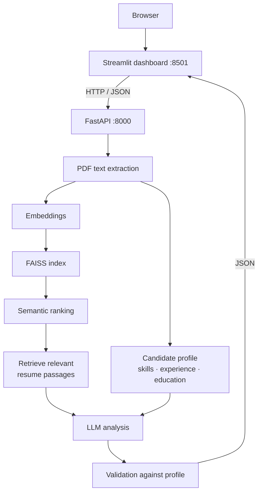

# Resume Screening AI

Resume Screening AI ranks a pool of PDF resumes against a job description and
explains each ranking. It is built for recruiters and hiring managers who need to
read a stack of resumes quickly, and for engineers who want the reasoning behind
a ranking to be inspectable rather than opaque.

It combines two techniques. **Semantic matching** embeds each resume and the job
description into vectors and compares them with a FAISS index, so a resume saying
"built REST services in Python" matches a role asking for "backend API
development" without sharing keywords. **Retrieval-augmented analysis** then
pulls the passages of one candidate's resume most relevant to the role, sends
only those to a language model, and validates the response against a profile
extracted from the resume by deterministic rules — removing claims the resume
does not support and recording every correction.

This is a decision-support tool for human review, not an automated screener. It
orders resumes and summarises them; it decides nothing. Similarity scores are
uncalibrated and comparable only within a single ranking, extraction is bounded
by a fixed skill vocabulary, and generated text can still be wrong in ways
validation cannot catch. Every analysis ships with the passages it was built
from, so a reviewer can check it.

## Features

- Multi-file PDF upload with per-file validation and clear rejection reasons,
  and text extraction from text-based PDFs
- Candidate profile extraction — skills, years of experience, degrees — by fixed
  taxonomy and explicit rules, with no model involved
- Sentence-embedding generation and FAISS vector search over the pool
- Semantic ranking against a pasted job description, then per-candidate
  retrieval of the resume passages most relevant to the role
- RAG-based analysis: summary, matched skills, skill gaps, experience
  assessment, education, and a coarse recommendation label
- Grounding validation that strips unsupported claims and reports what it removed
- Evidence display — retrieved passages shown beside the generated text
- Filtering, sorting and search across the ranked list, plus two charts
- Resume pool management: remove one, remove several, or clear the pool
- Screening sessions that reset the current role without deleting resumes
- REST API with generated OpenAPI documentation
- Streamlit dashboard that consumes that API over HTTP
- Command-line interface covering the same pipeline

## Architecture



Two local services. The **FastAPI backend** owns everything: parsing,
extraction, embeddings, FAISS indexes, retrieval, the model call and validation.
The **Streamlit dashboard** is a client of that API and nothing more — it imports
no pipeline module, holds no resume, and reads every number it displays from an
HTTP response. So the dashboard works unchanged if the backend moves hosts, and
the API is usable on its own.

Inside the backend the pool, the embedding model and the FAISS indexes are built
once and cached, keyed on a signature of the resume directory. Adding or deleting
a resume invalidates that cache, so a deleted candidate cannot reappear later.

## How It Works

1. **Text extraction.** PyMuPDF reads a PDF into clean text. There is no OCR, so
   image-only PDFs are reported unreadable rather than silently skipped.
2. **Candidate profile.** Rules and a fixed skill taxonomy extract skills, stated
   years of experience, and degrees. No model is involved, so the output is exact
   and repeatable — and it is what the generated analysis is later checked against.
3. **Embedding.** Sentence Transformers turns resume text and the job description
   into L2-normalised vectors, making an inner product equal to cosine similarity.
4. **Indexing.** Vectors go into a FAISS `IndexFlatIP`. Each candidate also gets
   their own index over their resume chunks, so passage retrieval for one
   candidate cannot pull text from another.
5. **Semantic ranking.** The job-description vector is compared against the pool
   and candidates are ordered by cosine similarity.
6. **Passage retrieval.** For the candidate being analysed, the chunks closest to
   the job description are selected. Only those reach the model.
7. **LLM analysis.** Those passages plus the extracted profile are sent to the
   configured provider, with instructions to use only that material.
8. **Validation.** The response is parsed and checked against the profile. Claims
   the resume does not support are removed and listed in `warnings`;
   `is_grounded` is `false` whenever anything had to be corrected.
9. **Display.** The dashboard renders the result beside the evidence it rests on.

## Technology Stack

| Component | Technology |
| --- | --- |
| Language | Python 3.11+ |
| API | FastAPI + Uvicorn |
| Validation | Pydantic |
| Dashboard | Streamlit |
| PDF parsing | PyMuPDF |
| Embeddings | Sentence Transformers (`all-MiniLM-L6-v2`) |
| Vector search | FAISS (`faiss-cpu`) |
| Numerics | NumPy |
| RAG | Implemented in this project: chunking, retrieval, prompt assembly and output validation on top of the embedding stack |
| LLM provider | Configurable — offline deterministic provider by default, Anthropic optional |
| HTTP client | httpx |
| Charts | Altair and pandas (bundled with Streamlit) |
| Testing | pytest |

There is no LangChain dependency. `app/llm.py` ships a `LangChainProvider`
adapter that can wrap any LangChain chat model, but nothing imports LangChain
unless you install it and choose to use it.

## Project Structure

```
.
├── app/
│   ├── api/                     FastAPI layer
│   │   main.py routes.py schemas.py service.py
│   │   dependencies.py config.py errors.py
│   │
│   ├── ui/                      Streamlit layer (an API client)
│   │   dashboard.py pages.py components.py api_client.py
│   │   formatting.py state.py theme.py config.py
│   │
│   │   parse, embed, index, rank
│   ├── resume_parser.py  embeddings.py  vector_store.py  matching.py
│   │
│   │   deterministic profile extraction
│   ├── skill_taxonomy.py  skill_extractor.py  experience_extractor.py
│   ├── education_extractor.py  candidate_analyzer.py
│   │
│   │   retrieval-augmented analysis
│   ├── chunker.py  retriever.py  rag_context.py  prompts.py  llm.py
│   ├── analysis_parser.py  rag_pipeline.py
│   │
│   ├── models.py                shared records
│   └── main.py                  command-line interface
│
├── data/job_descriptions/       three sample descriptions (fictional)
├── data/resumes/                candidate PDFs (contents not tracked)
├── scripts/generate_sample_data.py   writes nine fictional sample resumes
├── tests/                       35 test modules
├── .streamlit/config.toml       dashboard base theme
├── start_app.ps1  stop_app.ps1  start and stop both services
├── .env.example                 documented configuration template
└── requirements.txt  pytest.ini  README.md
```

## Quick Start

Windows PowerShell, from a clean clone:

```powershell
git clone <repository-url>
cd "LLM-Powered Resume Screening & Candidate Matching System"

python -m venv .venv
.\.venv\Scripts\Activate.ps1

pip install -r requirements.txt

copy .env.example .env          # optional; every setting has a default

python scripts\generate_sample_data.py

.\start_app.ps1
```

No API key is required: analysis defaults to an offline deterministic provider,
so the application and its full test suite run with no credentials. Dependencies
pull in PyTorch (~2 GB of disk) and the first ranking downloads the embedding
model (~90 MB); everything is local afterwards.

**If PowerShell blocks the script**, allow it for the current window only — this
changes nothing permanently:

```powershell
Set-ExecutionPolicy -Scope Process -ExecutionPolicy Bypass
```

## Open the Application

| What | URL |
| --- | --- |
| **Dashboard — start here** | <http://localhost:8501> |
| API | <http://127.0.0.1:8000> |
| API documentation (Swagger UI) | <http://127.0.0.1:8000/docs> |
| API documentation (ReDoc) | <http://127.0.0.1:8000/redoc> |

## Start / Stop

```powershell
.\start_app.ps1                              # default ports 8000 and 8501
.\start_app.ps1 -ApiPort 8100 -UiPort 8600   # different ports
.\stop_app.ps1
```

`start_app.ps1` finds a usable Python, loads `.env` if present, verifies the
required packages import, starts both services and waits for each health check
before printing the URLs. It is safe to run twice. `stop_app.ps1` stops only what
it started — it records each process id and start time under `.run/` and verifies
both first, so it cannot touch another project's Python.

### Starting by hand

Run these in **two separate terminals** with the virtual environment active. The
`python -m` form avoids depending on `PATH`:

```powershell
python -m uvicorn app.api.main:app --reload      # terminal 1 — the API
python -m streamlit run app/ui/dashboard.py      # terminal 2 — the dashboard
```

Started this way, nothing loads `.env` — set variables in your shell instead, as
described under [Configuration](#configuration).

### Command line

The same pipeline is available without either service:

```powershell
python -m app.main extract data\resumes\priya_sharma.pdf
python -m app.main match   --job-description data\job_descriptions\backend_engineer.txt
python -m app.main analyze --job-description data\job_descriptions\backend_engineer.txt
python -m app.main rag     --job-description data\job_descriptions\backend_engineer.txt
```

## Using the Application

1. Start the application and open <http://localhost:8501>.
2. On **Screening → Candidate pool**, add PDF resumes. Several can be uploaded at
   once; each is validated and added to the pool.
3. Paste the job description into the text box on the same page. The dashboard
   takes pasted text — the files in `data/job_descriptions/` are for the CLI.
4. On **Ranking**, choose how many candidates to return and rank them.
5. Review the ranked list; filter, sort or search it, and read each candidate's
   similarity score and band.
6. Pick a candidate and run **Analyze**. This is a separate per-candidate step,
   so an unanalysed candidate reads "Not analyzed yet" rather than showing zero.
7. On **Candidate**, read the summary, matched skills, skill gaps, experience
   assessment, education and recommendation — beside the retrieved passages the
   analysis was built from.
8. Use **Resumes** to remove one resume, several at once, or clear the pool.
   **New screening session** clears the current role and its results without
   deleting any resume.

## Understanding Candidate Results

The dashboard shows four measures that answer different questions and are not
interchangeable: **similarity ≠ skill coverage ≠ experience ≠ recommendation.**

### Similarity

Cosine similarity between the job-description embedding and the candidate's
resume embedding, computed for every candidate during ranking.

The API returns the raw value in `[-1.0, 1.0]` — for example `0.6566`. The
dashboard renders it as a percentage of that scale for readability: `65.66%`.
Same number, different presentation; the backend value is never rescaled.

That percentage is **not** a probability of being hired and **not** a percentage
of requirements met. It is a ranking signal, meaningful only as an ordering
within one ranking against one job description.

### Skill coverage

How many of the skills named in the job description were found in the resume,
shown as a count such as `7 / 8` rather than a percentage.

It comes from the deterministic extractor and the fixed taxonomy — not the
embedding, not the model. A candidate can rank well on similarity while showing
gaps here, and the reverse. It is produced only by the analysis step, so it is
blank until a candidate has been analysed.

### Experience

The years of experience stated in the resume, compared against what the job
description asks for, reported as "Requirement met", "Below requirement" or
"Not stated". It reflects what the resume claims, extracted by rule. A resume
that never states a number reads "Not stated" — never zero, never a failure.

### Recommendation

A coarse ordinal label from a fixed vocabulary: `STRONG_MATCH`, `GOOD_MATCH`,
`PARTIAL_MATCH`, `WEAK_MATCH` or `INSUFFICIENT_INFORMATION`. It is produced by
the analysis and validated against the extracted profile before being returned.
It is a triage label, not a score and not a hiring decision.

## API

Full interactive documentation is at <http://127.0.0.1:8000/docs>.

| Method and path | Purpose |
| --- | --- |
| `GET /health` | Liveness. Returns service name, version and configured provider name. Loads no model, reveals no credential. |
| `GET /candidates` | Lists candidates available on the server, plus files that could not be read. |
| `POST /upload-resume` | Uploads and parses one PDF. Multipart form: `file`, plus `store` (default `false`); `store=true` adds it to the pool. Returns text length, word count and a preview — not the full text. |
| `POST /match-candidates` | Ranks the pool against a job description. Body: `job_description`, optional `top_k`. Returns ranked results with raw cosine `similarity_score`. |
| `POST /analyze-candidate` | Grounded analysis of one candidate. Body: `candidate`, `job_description`. Returns summary, matched skills, skill gaps, experience assessment, education, recommendation, evidence, warnings and `is_grounded`. |
| `DELETE /candidates/{candidate_id}` | Deletes one candidate's resume from the pool. |
| `POST /candidates/delete` | Deletes several candidates in one request. |
| `DELETE /candidates` | Clears the pool. |

No endpoint accepts a filesystem path from a client. Uploads are written under
generated names inside the configured resume directory, and deletion re-checks
that the resolved file sits inside that directory before unlinking.

## Configuration

Every setting is optional — the project runs with no `.env` at all, each value
falling back to a documented default. Copy the template with
`copy .env.example .env`.

`.env` is your local configuration. **It is git-ignored and must never be
committed**; it is where an API key would go. `.env.example` is committed and
holds no real values.

The application reads **environment variables**, not the file itself. `.env` is
loaded by `start_app.ps1`; starting a service by hand, set them in your shell
instead — for example `$env:LLM_PROVIDER = "anthropic"`.

| Variable | Purpose |
| --- | --- |
| `RESUME_DIR` | Directory scanned for candidate PDFs. Default `data/resumes`. |
| `EMBEDDING_MODEL` | Sentence Transformers model id. Changing it changes every score. |
| `API_CORS_ORIGINS` | Allowed browser origins, comma separated. `*` is development-only. |
| `API_MAX_UPLOAD_BYTES` | Upload size ceiling. Default 5 MB. |
| `API_LOG_LEVEL` | Level for the application logger. Default `INFO`. |
| `API_BASE_URL` | Where the dashboard looks for the API. Default `http://127.0.0.1:8000`. |
| `API_TIMEOUT_SECONDS` | Timeout for health, listing, upload and matching. |
| `API_ANALYSIS_TIMEOUT_SECONDS` | Timeout for analysis, which makes a model call. |
| `UI_DEFAULT_TOP_K` | How many candidates the ranking asks for by default. |

### Optional language model provider

These four are the only settings that can involve a credential:

| Variable | Purpose |
| --- | --- |
| `LLM_PROVIDER` | `fake` (offline deterministic, **the default**) or `anthropic`. |
| `LLM_MODEL` | Model id for the chosen provider. Ignored when `fake`. |
| `LLM_API_KEY` | Required **only** when `LLM_PROVIDER=anthropic`. Leave blank otherwise. |
| `LLM_MAX_TOKENS` | Maximum tokens in a single response. Default 4096. |

The real provider also needs `pip install anthropic`, which is not in
`requirements.txt`. With no key configured, matching, upload, ranking and pool
management are unaffected — none of them calls a model.

## Testing

```powershell
python -m pytest
```

The suite runs offline and needs no credentials. A verified run collects 1321
tests: **1316 pass and 5 skip**.

The five skips are the real-provider tests in `tests/test_real_llm.py`, marked
`llm`. They skip themselves unless `LLM_PROVIDER` and `LLM_API_KEY` are set,
which is intended rather than a failure — the project must be testable without an
API key. To deselect them explicitly, `python -m pytest -m "not llm"`. A second
marker, `model`, covers tests needing the real embedding model; they download it
on first run and skip if it is unavailable.

## Troubleshooting

**`uvicorn` or `streamlit` is not recognized**, or `ModuleNotFoundError` for
fastapi, streamlit or torch. The virtual environment is not active, or packages
are missing. Activate it and run `pip install -r requirements.txt`; prefer the
`python -m` forms above, which do not depend on `PATH`.

**PowerShell refuses to run the scripts.** Run
`Set-ExecutionPolicy -Scope Process -ExecutionPolicy Bypass` in that window.

**Port already in use.** Another process holds 8000 or 8501. Run
`.\stop_app.ps1`, or use `.\start_app.ps1 -ApiPort 8100 -UiPort 8600`.

**The dashboard says the API cannot be reached.** Check
<http://127.0.0.1:8000/health>, and confirm `API_BASE_URL` matches where the API
is actually listening.

**`.env` seems to have no effect.** The application reads environment variables.
`start_app.ps1` loads `.env`; a manually started service does not.

**Analysis fails with a provider error.** `LLM_PROVIDER` names a real provider
without a working `LLM_API_KEY` or without `pip install anthropic`. Unset it to
return to the offline default.

**The first ranking is slow.** The embedding model is downloading and loading.
This happens once; later requests use the cached model.

## Local Data

| Path | Tracked? | What it is |
| --- | --- | --- |
| `app/`, `tests/`, `scripts/` | Yes | Source code |
| `data/job_descriptions/` | Yes | Fictional sample job descriptions |
| `data/resumes/*.pdf` | **No** | Uploaded and generated resumes — may contain personal data |
| `.streamlit/config.toml` | Yes | Dashboard base theme |
| `.env.example` | Yes | Configuration template, no credentials |
| `.env` | **No** | Local configuration, including any API key |
| `.venv/` | **No** | Virtual environment |
| `.run/` | **No** | Process ids and service logs from `start_app.ps1` |
| `__pycache__/`, `.pytest_cache/` | **No** | Generated caches |

Sample data and runtime uploads share one directory but differ: the samples are
fictional and regenerated on demand by `scripts/generate_sample_data.py`, while
uploads are real user data. Neither is committed — `data/resumes/` keeps only a
`.gitkeep`. To reset the pool, delete `data\resumes\*.pdf` and regenerate.

## Security Notes

- **There is no authentication.** Anyone who can reach the ports can use every
  endpoint and delete resumes. Run it locally; do not expose it to an untrusted
  network without putting your own access control in front of it.
- **Never commit `.env` or an API key.** `.env` is git-ignored and
  `.env.example` holds no real values.
- **Never commit real resumes.** They are personal data; `data/resumes/` is
  git-ignored for that reason.
- **No path is accepted from a client.** Uploads get generated names inside the
  configured directory, and deletion verifies containment before unlinking.
- **Errors reveal nothing internal.** No traceback, filesystem path or
  environment variable reaches a client; failures are logged server-side and
  answered with a fixed message.
- **Logs exclude sensitive content.** Endpoints, file names and outcomes are
  logged; resume text and credentials are not.
- Uploaded resumes stay on the machine running the API.

## Known Limitations

- No authentication or multi-user support; intended for local use.
- No OCR — scanned or image-only PDFs yield no text and are reported unreadable;
  multi-column layouts extract in reading order, which can interleave columns.
- Skill extraction is bounded by a fixed taxonomy; a skill outside it is not
  recognised.
- Similarity scores are uncalibrated ranking signals, not hiring probabilities,
  and are comparable only within one ranking.
- The embedding model can carry bias from its training data into rankings.
- Validation reduces hallucination but does not eliminate it — read the evidence.
- Analysis is synchronous and per-candidate, with no queue or cancellation.
- The pool is a local directory with no database; deletion is permanent, no undo.
- Analysis quality depends on the configured provider. The default offline
  provider is deterministic and useful for development, not a substitute for a
  real model.
